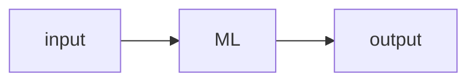

<center>数据和特征决定了机器学习的上限，而模型和算法只是逼近这个上限而已</center>

## 一、特征选择（feature selection）

**为什么要进行特征选择？**



观察上述流程图，假设$input$的数据特征为：{$t_1...t_n$}我们直接将输入投入到$ML$里面而后得到输出。但是问题来了，我们的特征$t_1...t_n$对于我们的$output$都有作用吗？

> 例子：定义我们的我们的$ML$为：男孩女孩判断模型，$input$的特征有：长/短头发、有/无喉结、邻居孩子男/女等，$output$为：男孩 or 女孩。
>
> 我相信很容易判断特征：**邻居孩子男/女**在对于我们模型效果上是不起作用的，那么的话在开始$input$时不添加该特征。

回归正题。**特征选择（feature selection）**作为一种数据预处理策略，在各种数据挖掘和机器学习问题准备数据（尤其是高维数据）方面是有效且高效的，**特征选择**的目标包括构建更简单、更易于理解的模型、提高数据挖掘性能以及准备干净、可理解的数据[^1]。

那么常用特征选择算法是什么呢？

---

## 1.1 传统特征选择算法

### 1.1.1 Wrapper method（包装法）

> Wrapper methods rely on the predictive performance of a predefined learning algorithm to evaluate the quality of selected features.
>
> wrapper方法依赖**预先定义的学习算法的预测性能**来评估所挑选特征的质量

**算法步骤**：


> 挑选特征子集，评估挑选特征直到合适为止

那么在Wrapper methods中对于特征子集的挑选就显得格外重要了，但是如若特征搜索空间为$d$那么就行搜索次数为$2^d$，也就是说使用Wrapper methods很容易陷入NP-hard problem。两类参见的特征筛选方法：

> 定义**全部特征**为：$Y=\{y_1...y_d\}$，定义**输出特征**：$X_k=\{x_j|j=1,2...k;x_j\in Y\}$

#### 1、**Sequential selection algorithms**（SFS）[^3]

* 1、SFS

$$
x^{+}=arg\ max\ J(X_k+x),\ x\in Y- X_k\\
X_k+1=X_k+x^+\\
k=k+1
$$

在空的特征子集中添加特征$x$使得目标函数$J$最大
* 2、Sequential Backward Selection（SBS）

$$
x^-=arg\ max\ J(X_k-x),\ x\in X_k\\
X_{k-1}=X_k-x^-\\
k=k-1\\
$$

与SFS相类似，只不过SBS是从完整的特征开始，而后逐渐减少特征。 

* 3、Sequential Floating Forward Selection （SFFS） 

2、**Heuristic Search Algorithms**

算法步骤：首先初始化：$X_0=\phi$，$k=0$

step1:
$$
x^{+}=arg\ max\ J(X_k+x),\ x\in Y- X_k\\
X_k+1=X_k+x^+\\
k=k+1\\
go \ to \ step2
$$

在空的特征子集中添加特征$x$使得目标函数$J$最大
step2:

$$
x^-=arg\ max\ J(X_k-x),\ x\in X_k\\
if\ J(X_k-x)>J(X_k)\\
X_{k-1}=X_k-x^-\\
k=k-1\\
go\ to\ step1
$$

SFFS较SFS多一个回溯操作（step2）
循环step1和step2只到达到目标$k$值停止。

```python
!pip install mlxtend 
from mlxtend.feature_selection import SequentialFeatureSelector as SFS
sfs = SFS(knn, #选择模型
          k_features=3, #选择筛选出的特征 
          forward=True, 
          floating=False, 
          scoring='accuracy', #评价标准
          cv=4, #交叉验证
          n_jobs=-1 #用于并行评估不同特征子集的CPU数量，-1代表全部)
sfs = sfs.fit(X, y)
print(sbfs.k_feature_idx_) #返回选择的特征的序号 k_feature_names_返回特征名称
print(sbfs.k_score_) #返回评分
"""
forward与floating参数选择：
1、SFS算法True False
2、SBS算法False False
3、SFFS算法 True True
"""
```

#### 2、Heuristic search algorithms 启发式搜索算法

Genetic Algorithm（GA）遗传算法

#### Wrapper methods缺点

1、计算代价高
2、容易过拟合

### 1.1.2 Filter methods（过滤法）

> Filter methods use variable ranking techniques as the principle criteria for variable selection by ordering
> Filter methods使用变量**排序方法**作为按顺序选择变量的原则标准

也就是说Fileter methods首先通过*排序*得到特征的相关性，而后进行筛选[^2]  !
**算法步骤**：


**排序方法（ranking methods）**

特征重要性计算有：
1、方差分析（ANOVA）：基于统计方法来计算特征与目标变量之间的相关程度，通过计算特征的F值来评估特征的重要性。
**2、互信息（Mutual Information）**：计算特征与目标变量之间的**信息增益**或互信息，衡量特征与目标变量之间的依赖关系。

> 如：通过信息增益进行评价
>
> 首先计算香农熵：
> $$
> H(Y)=-\sum p(y)log(p(y))
> $$
> 
>
> 条件熵计算：
> $$
> H(Y|X)=-\sum_{x} \sum_{y}p(x,y)log(p(y|x))
> $$
> 
>
> 而后计算：
> $$
> I(Y,X)=H(Y)-H(Y|X)
> $$
> 通过计算（3）就可以得到：如果$X$与$Y$之间相互独立那么将会趋近0

**3、相关系数（Correlation Coefficient）**：计算特征和目标变量之间的线性相关性，常用的方法有Pearson相关系数和Spearman相关系数。

> $$
> R(i)=\frac{cov(x_i,Y)}{\sqrt{var(x_i)*var(Y)}}
> $$
>
> 其中$Y$作为输出变量（output）而$x_i$则为我们的input

4、卡方检验（Chi-square Test）：针对分类问题，对特征和目标变量之间的关联程度进行检验，判断特征的重要性。

5、方差选择（Variance Threshold）：通过计算特征的方差来判断其重要性，方差较低的特征可能对目标变量的预测作用较小

```python
from sklearn.feature_selection import VarianceThreshold
X = [[0, 0, 1], [0, 1, 0], [1, 0, 0], [0, 1, 1], [0, 1, 0], [0, 1, 1]]
sel = VarianceThreshold(threshold=(.8 * (1 - .8))) #threshold指定特征选择的方法
sel.fit_transform(X)
"""
array([[0, 1],
       [1, 0],
       [0, 0],
       [1, 1],
       [1, 0],
       [1, 1]])
""""
```

> 参数说明：
>
> [sklearn-filter methods](https://scikit-learn.org/stable/modules/generated/sklearn.feature_selection.VarianceThreshold.html#sklearn.feature_selection.VarianceThreshold)

### 1.1.3 Embedded methods（嵌入法）

> Embedded methods is a tradeoff between filter and wrapper methods that embed the feature selection into model learning.
>
> Embedded方法将Wrapped和filter方法进行权衡，将特征选择嵌入到模型学习中去

## 1.2 其它特征选择方法

> 基于信息论：一般是指通过计算信息增益等来表示特征重要性
>
> 基于相似：主要通过计算特征体系中的各特征之间的“相似”。比如无监督特征选择：可以通过计算各自特征样本之间距离（距离近则相似）；而对于监督特征选择一般则是通过标签信息得到（比如可以计算相关矩阵等）

### 1.2.1 Laplacian Score 拉普拉斯分数[^5]

> HE X, CAI D, NIYOGI P. Laplacian Score for Feature Selection[C/OL]//Advances in Neural Information Processing Systems: 卷 18. MIT Press, 2005[2023-07-07].

**原文描述如下**：


**解释如下**：

> $f_{ri}$代表第$r$个特征的第$i$个样本；

1. **构建图(Graph)**：首先，需要构建一个图$G$，其中节点（$m$个节点）代表样本数据的特征，边代表特征之间的相似度或关联关系。常用的方法是使用**K近邻**来构建图，即对每个特征找到K个最近的邻居，并将它们连接起来。
2. 计算**亲和矩阵(Affinity Matrix)**：在构建了图之后，需要计算特征之间的相似度或关联性。**节点**之间彼此连接时通过使用：$S(i,j)=e^{-\frac{||x_i-x_j||^2}{t}}$，其中$x_i$为$x_j$的$p$个最相邻的节点，$t$为常数。如果节点之间不相互连接那么$S(i,j)=0$

   > $S_{ij}$较大，说明节点比较“接近”

3. 计算**拉普拉斯矩阵(Laplacian Matrix)**：首先定义**对角矩阵D（diagonal matrix D**）:$D(i,j)=\sum_{j=1}^{n}S(i,j)$。那么拉普拉斯矩阵为：$L=D-S$。
4. 计算每个特征的**拉普拉斯分数（Laplacian Score）**：

$$
L_r=\frac{\widetilde{f}_{r}^{T}L\widetilde{f_r}}{\widetilde{f}_{r}^{T}D\widetilde{f}_r}
$$

其中：$\widetilde{f_r}=f_r-\frac{f_r^TD1}{1^TD1}1$、$1=[1,...,1]^T$、$f_r=[f_{r1},...,f_{rm}]^T$、$D=diag(S1)$

5. 选择k个特征的任务可以通过选择具有**最小拉普拉斯分数**的前k个特征来解决
**代码如下**[^6]：

<details><ummary>详细代码</summary>
```python
import numpy as np
from scipy.sparse import *
from sklearn.metrics.pairwise import pairwise_distances
def lap_score(X, **kwargs):
    """
    This function implements the laplacian score feature selection, steps are as follows:
    1. Construct the affinity matrix W if it is not specified
    2. For the r-th feature, we define fr = X(:,r), D = diag(W*ones), ones = [1,...,1]', L = D - W
    3. Let fr_hat = fr - (fr'*D*ones)*ones/(ones'*D*ones)
    4. Laplacian score for the r-th feature is score = (fr_hat'*L*fr_hat)/(fr_hat'*D*fr_hat)
    Input
    -----
    X: {numpy array}, shape (n_samples, n_features)
        input data
    kwargs: {dictionary}
        W: {sparse matrix}, shape (n_samples, n_samples)
            input affinity matrix
    Output
    ------
    score: {numpy array}, shape (n_features,)
        laplacian score for each feature
    Reference
    ---------
    He, Xiaofei et al. "Laplacian Score for Feature Selection." NIPS 2005.
    """
    # if 'W' is not specified, use the default W
    if 'W' not in kwargs.keys():
        W = construct_W(X)
    # construct the affinity matrix W
    W = kwargs['W']
    # build the diagonal D matrix from affinity matrix W
    D = np.array(W.sum(axis=1))
    L = W
    tmp = np.dot(np.transpose(D), X)
    D = diags(np.transpose(D), [0])
    Xt = np.transpose(X)
    t1 = np.transpose(np.dot(Xt, D.todense()))
    t2 = np.transpose(np.dot(Xt, L.todense()))
    # compute the numerator of Lr
    D_prime = np.sum(np.multiply(t1, X), 0) - np.multiply(tmp, tmp)/D.sum()
    # compute the denominator of Lr
    L_prime = np.sum(np.multiply(t2, X), 0) - np.multiply(tmp, tmp)/D.sum()
    # avoid the denominator of Lr to be 0
    D_prime[D_prime < 1e-12] = 10000
    # compute laplacian score for all features
    score = 1 - np.array(np.multiply(L_prime, 1/D_prime))[0, :]
    return np.transpose(score)
def feature_ranking(score):
    """
    Rank features in ascending order according to their laplacian scores, the smaller the laplacian score is, the more
    important the feature is
    """
    idx = np.argsort(score, 0)
    return idx
def construct_W(X, **kwargs):
    """
    Construct the affinity matrix W through different ways
    Notes
    -----
    if kwargs is null, use the default parameter settings;
    if kwargs is not null, construct the affinity matrix according to parameters in kwargs
    Input
    -----
    X: {numpy array}, shape (n_samples, n_features)
        input data
    kwargs: {dictionary}
        parameters to construct different affinity matrix W:
        y: {numpy array}, shape (n_samples, 1)
            the true label information needed under the 'supervised' neighbor mode
        metric: {string}
            choices for different distance measures
            'euclidean' - use euclidean distance
            'cosine' - use cosine distance (default)
        neighbor_mode: {string}
            indicates how to construct the graph
            'knn' - put an edge between two nodes if and only if they are among the
                    k nearest neighbors of each other (default)
            'supervised' - put an edge between two nodes if they belong to same class
                    and they are among the k nearest neighbors of each other
        weight_mode: {string}
            indicates how to assign weights for each edge in the graph
            'binary' - 0-1 weighting, every edge receives weight of 1 (default)
            'heat_kernel' - if nodes i and j are connected, put weight W_ij = exp(-norm(x_i - x_j)/2t^2)
                            this weight mode can only be used under 'euclidean' metric and you are required
                            to provide the parameter t
            'cosine' - if nodes i and j are connected, put weight cosine(x_i,x_j).
                        this weight mode can only be used under 'cosine' metric
        k: {int}
            choices for the number of neighbors (default k = 5)
        t: {float}
            parameter for the 'heat_kernel' weight_mode
        fisher_score: {boolean}
            indicates whether to build the affinity matrix in a fisher score way, in which W_ij = 1/n_l if yi = yj = l;
            otherwise W_ij = 0 (default fisher_score = false)
        reliefF: {boolean}
            indicates whether to build the affinity matrix in a reliefF way, NH(x) and NM(x,y) denotes a set of
            k nearest points to x with the same class as x, and a different class (the class y), respectively.
            W_ij = 1 if i = j; W_ij = 1/k if x_j \in NH(x_i); W_ij = -1/(c-1)k if x_j \in NM(x_i, y) (default reliefF = false)
    Output
    ------
    W: {sparse matrix}, shape (n_samples, n_samples)
        output affinity matrix W
    """
    # default metric is 'cosine'
    if 'metric' not in kwargs.keys():
        kwargs['metric'] = 'cosine'
    # default neighbor mode is 'knn' and default neighbor size is 5
    if 'neighbor_mode' not in kwargs.keys():
        kwargs['neighbor_mode'] = 'knn'
    if kwargs['neighbor_mode'] == 'knn' and 'k' not in kwargs.keys():
        kwargs['k'] = 5
    if kwargs['neighbor_mode'] == 'supervised' and 'k' not in kwargs.keys():
        kwargs['k'] = 5
    if kwargs['neighbor_mode'] == 'supervised' and 'y' not in kwargs.keys():
        print ('Warning: label is required in the supervised neighborMode!!!')
        exit(0)
    # default weight mode is 'binary', default t in heat kernel mode is 1
    if 'weight_mode' not in kwargs.keys():
        kwargs['weight_mode'] = 'binary'
    if kwargs['weight_mode'] == 'heat_kernel':
        if kwargs['metric'] != 'euclidean':
            kwargs['metric'] = 'euclidean'
        if 't' not in kwargs.keys():
            kwargs['t'] = 1
    elif kwargs['weight_mode'] == 'cosine':
        if kwargs['metric'] != 'cosine':
            kwargs['metric'] = 'cosine'
    # default fisher_score and reliefF mode are 'false'
    if 'fisher_score' not in kwargs.keys():
        kwargs['fisher_score'] = False
    if 'reliefF' not in kwargs.keys():
        kwargs['reliefF'] = False
    n_samples, n_features = np.shape(X)
    # choose 'knn' neighbor mode
    if kwargs['neighbor_mode'] == 'knn':
        k = kwargs['k']
        if kwargs['weight_mode'] == 'binary':
            if kwargs['metric'] == 'euclidean':
                # compute pairwise euclidean distances
                D = pairwise_distances(X)
                D **= 2
                # sort the distance matrix D in ascending order
                dump = np.sort(D, axis=1)
                idx = np.argsort(D, axis=1)
                # choose the k-nearest neighbors for each instance
                idx_new = idx[:, 0:k+1]
                G = np.zeros((n_samples*(k+1), 3))
                G[:, 0] = np.tile(np.arange(n_samples), (k+1, 1)).reshape(-1)
                G[:, 1] = np.ravel(idx_new, order='F')
                G[:, 2] = 1
                # build the sparse affinity matrix W
                W = csc_matrix((G[:, 2], (G[:, 0], G[:, 1])), shape=(n_samples, n_samples))
                bigger = np.transpose(W) > W
                W = W - W.multiply(bigger) + np.transpose(W).multiply(bigger)
                return W
            elif kwargs['metric'] == 'cosine':
                # normalize the data first
                X_normalized = np.power(np.sum(X*X, axis=1), 0.5)
                for i in range(n_samples):
                    X[i, :] = X[i, :]/max(1e-12, X_normalized[i])
                # compute pairwise cosine distances
                D_cosine = np.dot(X, np.transpose(X))
                # sort the distance matrix D in descending order
                dump = np.sort(-D_cosine, axis=1)
                idx = np.argsort(-D_cosine, axis=1)
                idx_new = idx[:, 0:k+1]
                G = np.zeros((n_samples*(k+1), 3))
                G[:, 0] = np.tile(np.arange(n_samples), (k+1, 1)).reshape(-1)
                G[:, 1] = np.ravel(idx_new, order='F')
                G[:, 2] = 1
                # build the sparse affinity matrix W
                W = csc_matrix((G[:, 2], (G[:, 0], G[:, 1])), shape=(n_samples, n_samples))
                bigger = np.transpose(W) > W
                W = W - W.multiply(bigger) + np.transpose(W).multiply(bigger)
                return W
        elif kwargs['weight_mode'] == 'heat_kernel':
            t = kwargs['t']
            # compute pairwise euclidean distances
            D = pairwise_distances(X)
            D **= 2
            # sort the distance matrix D in ascending order
            dump = np.sort(D, axis=1)
            idx = np.argsort(D, axis=1)
            idx_new = idx[:, 0:k+1]
            dump_new = dump[:, 0:k+1]
            # compute the pairwise heat kernel distances
            dump_heat_kernel = np.exp(-dump_new/(2*t*t))
            G = np.zeros((n_samples*(k+1), 3))
            G[:, 0] = np.tile(np.arange(n_samples), (k+1, 1)).reshape(-1)
            G[:, 1] = np.ravel(idx_new, order='F')
            G[:, 2] = np.ravel(dump_heat_kernel, order='F')
            # build the sparse affinity matrix W
            W = csc_matrix((G[:, 2], (G[:, 0], G[:, 1])), shape=(n_samples, n_samples))
            bigger = np.transpose(W) > W
            W = W - W.multiply(bigger) + np.transpose(W).multiply(bigger)
            return W
        elif kwargs['weight_mode'] == 'cosine':
            # normalize the data first
            X_normalized = np.power(np.sum(X*X, axis=1), 0.5)
            for i in range(n_samples):
                    X[i, :] = X[i, :]/max(1e-12, X_normalized[i])
            # compute pairwise cosine distances
            D_cosine = np.dot(X, np.transpose(X))
            # sort the distance matrix D in ascending order
            dump = np.sort(-D_cosine, axis=1)
            idx = np.argsort(-D_cosine, axis=1)
            idx_new = idx[:, 0:k+1]
            dump_new = -dump[:, 0:k+1]
            G = np.zeros((n_samples*(k+1), 3))
            G[:, 0] = np.tile(np.arange(n_samples), (k+1, 1)).reshape(-1)
            G[:, 1] = np.ravel(idx_new, order='F')
            G[:, 2] = np.ravel(dump_new, order='F')
            # build the sparse affinity matrix W
            W = csc_matrix((G[:, 2], (G[:, 0], G[:, 1])), shape=(n_samples, n_samples))
            bigger = np.transpose(W) > W
            W = W - W.multiply(bigger) + np.transpose(W).multiply(bigger)
            return W
    # choose supervised neighborMode
    elif kwargs['neighbor_mode'] == 'supervised':
        k = kwargs['k']
        # get true labels and the number of classes
        y = kwargs['y']
        label = np.unique(y)
        n_classes = np.unique(y).size
        # construct the weight matrix W in a fisherScore way, W_ij = 1/n_l if yi = yj = l, otherwise W_ij = 0
        if kwargs['fisher_score'] is True:
            W = lil_matrix((n_samples, n_samples))
            for i in range(n_classes):
                class_idx = (y == label[i])
                class_idx_all = (class_idx[:, np.newaxis] & class_idx[np.newaxis, :])
                W[class_idx_all] = 1.0/np.sum(np.sum(class_idx))
            return W
        # construct the weight matrix W in a reliefF way, NH(x) and NM(x,y) denotes a set of k nearest
        # points to x with the same class as x, a different class (the class y), respectively. W_ij = 1 if i = j;
        # W_ij = 1/k if x_j \in NH(x_i); W_ij = -1/(c-1)k if x_j \in NM(x_i, y)
        if kwargs['reliefF'] is True:
            # when xj in NH(xi)
            G = np.zeros((n_samples*(k+1), 3))
            id_now = 0
            for i in range(n_classes):
                class_idx = np.column_stack(np.where(y == label[i]))[:, 0]
                D = pairwise_distances(X[class_idx, :])
                D **= 2
                idx = np.argsort(D, axis=1)
                idx_new = idx[:, 0:k+1]
                n_smp_class = (class_idx[idx_new[:]]).size
                if len(class_idx) <= k:
                    k = len(class_idx) - 1
                G[id_now:n_smp_class+id_now, 0] = np.tile(class_idx, (k+1, 1)).reshape(-1)
                G[id_now:n_smp_class+id_now, 1] = np.ravel(class_idx[idx_new[:]], order='F')
                G[id_now:n_smp_class+id_now, 2] = 1.0/k
                id_now += n_smp_class
            W1 = csc_matrix((G[:, 2], (G[:, 0], G[:, 1])), shape=(n_samples, n_samples))
            # when i = j, W_ij = 1
            for i in range(n_samples):
                W1[i, i] = 1
            # when x_j in NM(x_i, y)
            G = np.zeros((n_samples*k*(n_classes - 1), 3))
            id_now = 0
            for i in range(n_classes):
                class_idx1 = np.column_stack(np.where(y == label[i]))[:, 0]
                X1 = X[class_idx1, :]
                for j in range(n_classes):
                    if label[j] != label[i]:
                        class_idx2 = np.column_stack(np.where(y == label[j]))[:, 0]
                        X2 = X[class_idx2, :]
                        D = pairwise_distances(X1, X2)
                        idx = np.argsort(D, axis=1)
                        idx_new = idx[:, 0:k]
                        n_smp_class = len(class_idx1)*k
                        G[id_now:n_smp_class+id_now, 0] = np.tile(class_idx1, (k, 1)).reshape(-1)
                        G[id_now:n_smp_class+id_now, 1] = np.ravel(class_idx2[idx_new[:]], order='F')
                        G[id_now:n_smp_class+id_now, 2] = -1.0/((n_classes-1)*k)
                        id_now += n_smp_class
            W2 = csc_matrix((G[:, 2], (G[:, 0], G[:, 1])), shape=(n_samples, n_samples))
            bigger = np.transpose(W2) > W2
            W2 = W2 - W2.multiply(bigger) + np.transpose(W2).multiply(bigger)
            W = W1 + W2
            return W
        if kwargs['weight_mode'] == 'binary':
            if kwargs['metric'] == 'euclidean':
                G = np.zeros((n_samples*(k+1), 3))
                id_now = 0
                for i in range(n_classes):
                    class_idx = np.column_stack(np.where(y == label[i]))[:, 0]
                    # compute pairwise euclidean distances for instances in class i
                    D = pairwise_distances(X[class_idx, :])
                    D **= 2
                    # sort the distance matrix D in ascending order for instances in class i
                    idx = np.argsort(D, axis=1)
                    idx_new = idx[:, 0:k+1]
                    n_smp_class = len(class_idx)*(k+1)
                    G[id_now:n_smp_class+id_now, 0] = np.tile(class_idx, (k+1, 1)).reshape(-1)
                    G[id_now:n_smp_class+id_now, 1] = np.ravel(class_idx[idx_new[:]], order='F')
                    G[id_now:n_smp_class+id_now, 2] = 1
                    id_now += n_smp_class
                # build the sparse affinity matrix W
                W = csc_matrix((G[:, 2], (G[:, 0], G[:, 1])), shape=(n_samples, n_samples))
                bigger = np.transpose(W) > W
                W = W - W.multiply(bigger) + np.transpose(W).multiply(bigger)
                return W
            if kwargs['metric'] == 'cosine':
                # normalize the data first
                X_normalized = np.power(np.sum(X*X, axis=1), 0.5)
                for i in range(n_samples):
                    X[i, :] = X[i, :]/max(1e-12, X_normalized[i])
                G = np.zeros((n_samples*(k+1), 3))
                id_now = 0
                for i in range(n_classes):
                    class_idx = np.column_stack(np.where(y == label[i]))[:, 0]
                    # compute pairwise cosine distances for instances in class i
                    D_cosine = np.dot(X[class_idx, :], np.transpose(X[class_idx, :]))
                    # sort the distance matrix D in descending order for instances in class i
                    idx = np.argsort(-D_cosine, axis=1)
                    idx_new = idx[:, 0:k+1]
                    n_smp_class = len(class_idx)*(k+1)
                    G[id_now:n_smp_class+id_now, 0] = np.tile(class_idx, (k+1, 1)).reshape(-1)
                    G[id_now:n_smp_class+id_now, 1] = np.ravel(class_idx[idx_new[:]], order='F')
                    G[id_now:n_smp_class+id_now, 2] = 1
                    id_now += n_smp_class
                # build the sparse affinity matrix W
                W = csc_matrix((G[:, 2], (G[:, 0], G[:, 1])), shape=(n_samples, n_samples))
                bigger = np.transpose(W) > W
                W = W - W.multiply(bigger) + np.transpose(W).multiply(bigger)
                return W
        elif kwargs['weight_mode'] == 'heat_kernel':
            G = np.zeros((n_samples*(k+1), 3))
            id_now = 0
            for i in range(n_classes):
                class_idx = np.column_stack(np.where(y == label[i]))[:, 0]
                # compute pairwise cosine distances for instances in class i
                D = pairwise_distances(X[class_idx, :])
                D **= 2
                # sort the distance matrix D in ascending order for instances in class i
                dump = np.sort(D, axis=1)
                idx = np.argsort(D, axis=1)
                idx_new = idx[:, 0:k+1]
                dump_new = dump[:, 0:k+1]
                t = kwargs['t']
                # compute pairwise heat kernel distances for instances in class i
                dump_heat_kernel = np.exp(-dump_new/(2*t*t))
                n_smp_class = len(class_idx)*(k+1)
                G[id_now:n_smp_class+id_now, 0] = np.tile(class_idx, (k+1, 1)).reshape(-1)
                G[id_now:n_smp_class+id_now, 1] = np.ravel(class_idx[idx_new[:]], order='F')
                G[id_now:n_smp_class+id_now, 2] = np.ravel(dump_heat_kernel, order='F')
                id_now += n_smp_class
            # build the sparse affinity matrix W
            W = csc_matrix((G[:, 2], (G[:, 0], G[:, 1])), shape=(n_samples, n_samples))
            bigger = np.transpose(W) > W
            W = W - W.multiply(bigger) + np.transpose(W).multiply(bigger)
            return W
        elif kwargs['weight_mode'] == 'cosine':
            # normalize the data first
            X_normalized = np.power(np.sum(X*X, axis=1), 0.5)
            for i in range(n_samples):
                X[i, :] = X[i, :]/max(1e-12, X_normalized[i])
            G = np.zeros((n_samples*(k+1), 3))
            id_now = 0
            for i in range(n_classes):
                class_idx = np.column_stack(np.where(y == label[i]))[:, 0]
                # compute pairwise cosine distances for instances in class i
                D_cosine = np.dot(X[class_idx, :], np.transpose(X[class_idx, :]))
                # sort the distance matrix D in descending order for instances in class i
                dump = np.sort(-D_cosine, axis=1)
                idx = np.argsort(-D_cosine, axis=1)
                idx_new = idx[:, 0:k+1]
                dump_new = -dump[:, 0:k+1]
                n_smp_class = len(class_idx)*(k+1)
                G[id_now:n_smp_class+id_now, 0] = np.tile(class_idx, (k+1, 1)).reshape(-1)
                G[id_now:n_smp_class+id_now, 1] = np.ravel(class_idx[idx_new[:]], order='F')
                G[id_now:n_smp_class+id_now, 2] = np.ravel(dump_new, order='F')
                id_now += n_smp_class
            # build the sparse affinity matrix W
            W = csc_matrix((G[:, 2], (G[:, 0], G[:, 1])), shape=(n_samples, n_samples))
            bigger = np.transpose(W) > W
            W = W - W.multiply(bigger) + np.transpose(W).multiply(bigger)
            return W
import pandas as pd
from sklearn.model_selection import train_test_split #数据集划分
data = pd.read_excel(r'path')
data = data.drop(data[data['PM10']=='—'].index) #去除缺失数据
data.head()
x = data.iloc[:,7:]
y = data['AQI']
X_train, X_test, y_train, y_test = train_test_split(x, y, test_size=0.2, random_state=40)
kwargs_W = {"metric":"euclidean","neighbor_mode":"knn","weight_mode":"heat_kernel","k":5,'t':1}
W = construct_W(x, **kwargs_W)
score = lap_score(x.values, W=W)
idx = feature_ranking(score)
score, idx
```
</details>

代码运行结果：


### 1.2.2 Fisher Score

Fisher Score是一种监督特征选取算法，通过挑选特征使得同一样本中特征值相似，不同类别特征值不相似。计算公式如下：

$$
f_i=\frac{\sum_{j=1}^{c}n_j(\mu_{ij}-\mu_i)^2}{\sum_{j=1}^{c}n_j\sigma_{ij}^{2}}
$$
其中$n_j$代表类别$j$的数量、$\mu_{ij}$代表$j$类样本特征$f_i$的平均值、$\mu_j$代笔特征$f_i$的平均值

## 1.3 总结


## 二、数据降维

为什么要进行数据降维度?数据维度又是什么?
> 数据降维:将高维空间数据投影到低维空间,目的在于将数据的特征维度降低,作用和特征筛选的作用相类似但是两种之间有一定区别(两者都属于**降低数据维度方法**):
> 数据降维和特征筛选:两者都是对数据的维度进行减少,但是特征筛选:侧重在于从$D$维特征从选择$d$维特征,数据特征个数发生减少;数据降维:从高维向低维投影;通俗易懂描述为:**前者为阉割**(数量变化),**后者为压缩**("形状"变化)
数据降维分类[^4]：


### 2.1 Principal Components Analysis（PCA）主成分分析

PCA是一种**线性降维技术**，即通过将数据嵌入到较低维的线性子空间中来进行降维。
>PCA通过寻找低维数据对高维数据进行描述

数学原理如下：对于原始数据$X$通过找到**映射**$M$将原始数据从较高维度的$D$维转化为较低维度的$d$维即:$Y=XM$($Y$代表转化后的低维数据),那么问题关键在于对于**映射**$M$的寻找.
PCA算法流程:
1、对输入数据$X=\{x_1...x_n\}$进行中心化:$x_i=x_i- \frac{1}{m}\sum_{j=1}^{n}x_j $
2、对中心化的数据计算协方差矩阵:$X^TX$
3、计算协方差矩阵特征值,并且得到最大的$n^{'}$($n^{'}$代表要降低到的维度)个特征值所对应特征向量:$M=(w_1..w_{n^{'}})$
4、对样本进行转换:$Y=XM$

```python
from sklearn.decomposition import PCA
x = np.random.randn(10,5)
pca = PCA(3)
pca.fit(x)
pca.transform(x) #转化
pca.explained_variance_ratio_ #贡献
```


## 参考文献

[1] LI J, CHENG K, WANG S, 等. Feature Selection:A Data Perspective[J/OL]. ACM Computing Surveys, 2018, 50(6): 1-45. https://doi.org/10.1145/3136625.
[2]CHANDRASHEKAR G, SAHIN F. A survey on feature selection methods[J/OL]. Computers & Electrical Engineering, 2014, 40(1): 16-28. DOI:[10.1016/j.compeleceng.2013.11.024](https://doi.org/10.1016/j.compeleceng.2013.11.024).
[3]https://rasbt.github.io/mlxtend/user_guide/feature_selection/SequentialFeatureSelector/
[4]Van Der Maaten, Laurens, Eric Postma, and Jaap Van den Herik."Dimensionality reduction:a comparative." *J Mach Learn Res* 10.66-71 (2009).
[5]HE X, CAI D, NIYOGI P.Laplacian Score for Feature Selection[C/OL]//Advances in Neural Information Processing Systems: 卷 18. MIT Press, 2005[2023-07-07].

## 推荐阅读

⭐⭐⭐LI J, CHENG K, WANG S, 等. Feature Selection: A Data Perspective[J/OL]. ACM Computing Surveys, 2018, 50(6): 1-45. https://doi.org/10.1145/3136625.
⭐⭐Van Der Maaten, Laurens, Eric Postma, and Jaap Van den Herik."Dimensionality reduction:a comparative." *J Mach Learn Res* 10.66-71 (2009).


[^1]:https://doi.org/10.1145/3136625
[^2]:[10.1016/j.compeleceng.2013.11.024](https://doi.org/10.1016/j.compeleceng.2013.11.024)
[^3]:https://rasbt.github.io/mlxtend/user_guide/feature_selection/SequentialFeatureSelector/
[^4]:https://members.loria.fr/moberger/Enseignement/AVR/Exposes/TR_Dimensiereductie.pdf
[^5]:https://proceedings.neurips.cc/paper_files/paper/2005/file/b5b03f06271f8917685d14cea7c6c50a-Paper.pdf
[^6]:https://github.com/jundongl/scikit-feature


