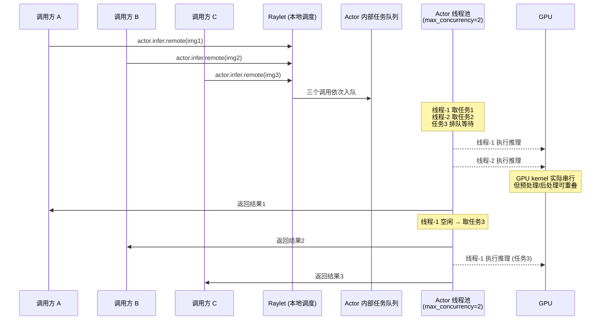
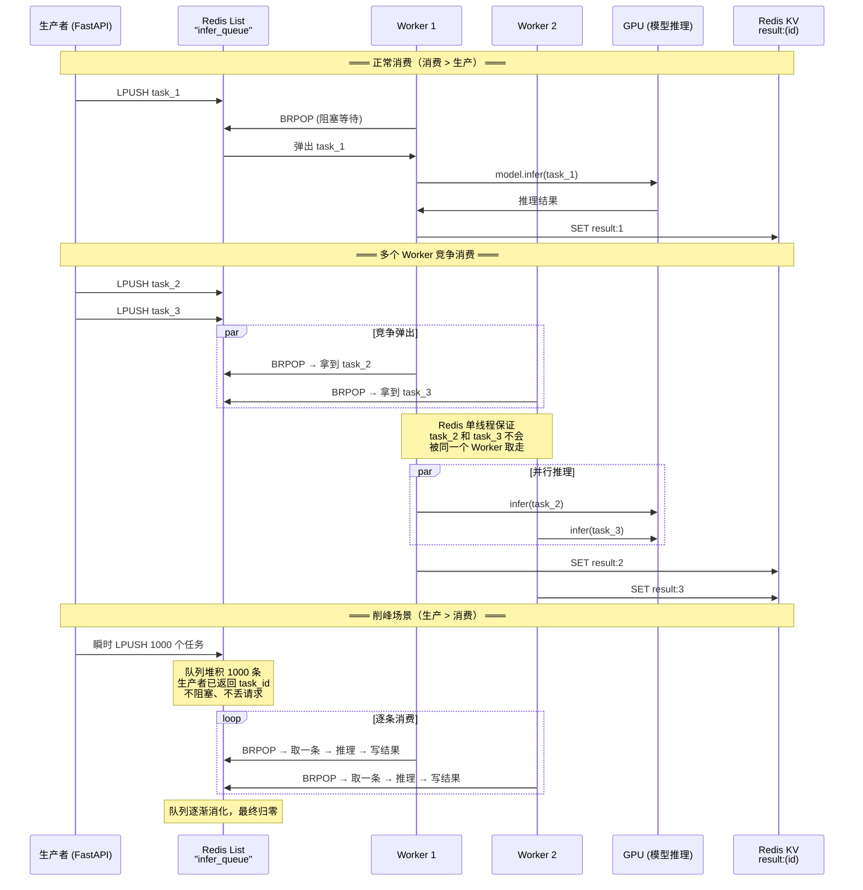
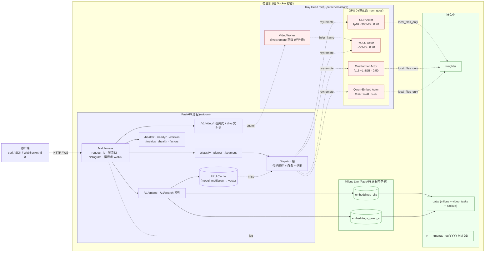

前面介绍了在[pytorch中不同的分布式训练实现方式](https://www.big-yellow-j.top/posts/2026/04/20/torch-basic-distribute-1.html)，这里简单介绍分布式框架（更加多的设计到了模型部署、服务器调度之间内容，非严格的pytorch内容）Ray以及Docker等内容。
## 前置知识 
所有内容只去介绍基本概念与使用，更加丰富的细节建议去看官方文档（或者直接AI）。docker文档[^3]、FastAPI[^4]
### 并发控制
对于高并发问题最简单理解方式：100个请求同时发送过来你如何进行处理这100个请求。可以串行解决（做完A做B）也可以并行处理（处理A的同时去处理B）
> 高并发是一个复杂工程设计问题：比如说你的请求优先级高那么如何进行“插队”处理、你的视频内容很长直接下载放到内存中会导致内存问题、其他请求超时如何处理（比如处理1个请求10s超时设置时间是30s那么如果请求很多就会出现超时问题）等等

下面主要去介绍常用的处理 **高并发处理方式**如通过异步/多线程/多进程进行处理、通过Redis队列进行控制、基于Ray原生的处理方式进行控制等等。
#### 异步/多线程/多进程
**首先程序任务主要为两类**：*1、CPU 密集*：一直在"**算**"，CPU 满载（图片处理、模型推理、加密、大量计算）；*2、IO 密集*：大量时间在"**等**"（网络请求/读写文件）。而对于异步/多线程/多进程可以简单理解为（以餐厅服务多人为例）：一个服务员等菜的时候去别的桌子（*异步*）、多个服务员同时共用一个厨师（*多线程*）、直接开多家餐厅（*多进程*）
> 进程好理解，在python有 GIL（全局解释器锁），同一时刻只有一个线程能执行 Python 代码，因此对于多线程和异步（两个都是处理IO密集的）使用“差异不大”，如果并发大（比如1w请求）可以考虑异步（不可能开1w个进程）、如果库是同步的就多线程（如request）

**异步核心语法**[^5]，一般而言异步核心（一般而言涉及到高IO的可以用异步）就是如下几组语法：
```python
import asyncio
# 声明协程函数
async def main():
    # 等待可以去执行其他任务
    await asyncio.sleep(3)
    # 创建 task，提交给事件循环调度执行（await 让出后才真正跑）
    task = asyncio.create_task(fetch())
# 创建 event loop 将main放进去进行循环调度
asyncio.run(main())
```
写异步操作过程中需要去注意：1、先去分析任务类型（如果是IO密集的），比如说使用fastapi中构建请求，就可以直接大胆的用异步比如说：
```python
@app.get("/health")
async def health():
    ...
```
2、对于异步中其他语法可以简单理解：
* `await`：等待一个异步任务执行完成，并在等待期间主动让出 CPU 控制权，让事件循环去执行其他协程，不过await后只能跟协程/task/future
* `asyncio.run`：启动整个异步程序，并创建事件循环（Event Loop）去执行指定协程
* `asyncio.create_task`：去创建多个task任务，比如说一般会有health任务去检查所有服务，那么可以直接通过此方法直接去创建多个task然后异步执行
* `asyncio.gather`：并发执行多个协程，并等待所有协程全部完成后统一返回结果

#### Ray原始并发控制
Ray 在 actor/task 层面提供了原生的并发与容错控制，核心参数都写在 `@ray.remote` 装饰器（或调用时的 `.options()`）里：
```python
@ray.remote(
    num_gpus=0.25,          # GPU 配额:分数=多个 actor 分时共用一张卡(逻辑调度配额,非物理隔离)
    max_concurrency=4,      # actor 内并发上限:一个 actor 同时最多处理 4 个调用(线程池)
    max_restarts=3,         # actor 进程崩溃后最多自动重建 3 次
    max_task_retries=2,     # 单次调用失败后最多自动重试 2 次
)
class Model:
    def infer(self, x): ...
```

**并发控制原理**：Ray 对 Actor 的并发控制分为两层——`调度层` 和 `执行层`。调度层由 Raylet + GCS 负责：当多个调用同时发往同一个 Actor 时，Raylet 先把它们放进该 Actor 的`内部任务队列`；执行层由 Actor 进程内的`线程池`（大小 = `max_concurrency`）消费这个队列——每个线程从队列取一个调用执行，执行完再取下一个，直到队列为空。



> 关键理解：`max_concurrency` 只是决定了**同时有几个线程在"伺候"这个 Actor**，但 GPU 计算本身是串行的——多个线程的 GPU kernel 在 CUDA stream 上排队执行。所以 `max_concurrency` 的实际收益来自**让 IO/预处理与 GPU 计算重叠**（线程 A 等在 GPU 上时，线程 B 可以做图像解码），而不是让 GPU "同时算两件事"。

几个要点：
* `max_concurrency`：控制 `单个 actor 内部` 的并发。注意 Python GIL + GPU kernel 本身是串行的，设 `>1` 主要让预处理/IO 与计算重叠，真正的 GPU 计算还是排队；对 `非线程安全` 的模型（比如 vLLM 引擎）必须设成 `1` 强制串行，否则并发进同一模型会崩。
* `num_gpus`：填分数（`<1`）时多个 actor 会被打包到同一张卡`分时复用`，它是 Ray 的`调度配额`不是显存物理隔离，所以同卡上几个 actor 的显存要自己算好别超（比如 `0.2+0.5+0.3=1.0` 刚好一张卡）。
* `max_restarts` + `max_task_retries`：`容错`，actor 崩了 Ray 自动拉起、调用失败自动重试。
* 超时取消：`ray.get(ref, timeout=...)` 超时后可 `ray.cancel(ref)`，但 `同步方法一旦开跑就无法中断`，cancel 只能撤掉还没起跑的排队任务（所以超时了 GPU 其实还在跑，要靠限流从源头控制）。

> Ray 原生并发是"actor 内"的并发，实际工程里常在它之上再加一层 `API 入口的信号量/限流做背压`：给每个模型建一个大小 = 它 `max_concurrency` 的信号量，满额直接拒绝（快速失败返回 `503`），而不是让请求堆在 Ray 队列里干等到超时——这样慢模型的积压不会白白空耗 GPU，超时也不会误触发`熔断`。

#### Redis队列控制
用 Redis 做队列本质是`削峰填谷`：请求先进队列缓冲，后端 worker 按自己的处理能力慢慢消费，避免瞬时高并发直接压垮推理服务。典型三个角色：
* `生产者`（API 层）：收到请求把任务塞进 Redis 队列（`LPUSH`），立刻返回一个任务 id（异步任务模式，不阻塞等结果）。
* `消费者`（worker）：循环从队列阻塞取任务（`BRPOP`）处理，结果写回 Redis（`SET result:<id>`）。
* `客户端`：拿 id 轮询结果，或用 WebSocket 等服务端推送。

**并发控制原理**：Redis 队列实现的是`消费端拉取`模式——不是服务端主动推送，而是多个 worker 自己去抢任务，天然形成`竞争消费`。核心依赖 Redis List 的以下特性：

| 命令 | 行为 | 并发中的作用 |
|:----:|:-----|:-----------|
| `LPUSH` | 从左侧入队（生产者写） | O(1)，瞬时写入不阻塞，抗住突发流量 |
| `BRPOP` | 从右侧**阻塞**弹出（消费者取） | 队列空时阻塞等待，不空转 CPU；多个消费者同时 `BRPOP` 同一队列时，Redis **单线程**保证同一任务只会被一个消费者取走，不会有"抢到同一个任务"的问题 |
| `LLEN` | 查看队列长度 | 监控积压：队列持续增长说明消费跟不上，需要加 worker 或优化推理 |



> 关键理解：Redis 队列的并发能力来自 **"单队列 + 多消费者竞争"**——队列本身只是一条 List，没有复杂的锁或分片，但多个 Worker 同时 `BRPOP` 时，Redis 的单线程模型天然保证每条任务只被一个 Worker 取走，不需要额外的分布式锁。横向扩展只需要加 Worker 进程数即可，Worker 之间完全无状态、无协调开销。

```python
import redis
r = redis.Redis()

# 生产者:入队,立即返回 task_id
r.lpush("infer_queue", task_json)

# 消费者:阻塞取任务 --> 推理 --> 结果回写(存1小时)
_, task = r.brpop("infer_queue")
result = model.infer(task)
r.set(f"result:{task_id}", result, ex=3600)
```
它的价值：
* `削峰`：1w 请求瞬时进来，队列缓冲，worker 不会被打爆；
* `限流/优先级`：用多个队列（高优先级队列先消费）就能实现前面说的“插队”；
* `解耦+横向扩展`：worker 可以多开几个进程/机器一起消费同一个队列。

> 生产上一般不自己撸队列，直接用 Celery / RQ（底层就是拿 Redis 当 broker）。这套模式最适合`耗时任务异步化`——比如前面提到的“长视频处理”，把同步 HTTP 变成“提交任务-->轮询/回调拿结果”，请求端秒回不占连接。

#### 增加节点副本数量

在使用 [Ray进行并发控制](#ray原始并发控制)中单 actor 进程内推理串行（一个模型实例同时只跑一个请求），如果去提高并发数量可以直接 “扩充节点副本”（比如将开始的同一个功能的一个节点直接拓展到n个节点，通过这种方式同时也**会带来显存的额外占用**）其本质和多进程是相似的比如说下面代码：
```python
import ray
from itertools import cycle

@ray.remote
class ModelA:
    def __init__(self): pass
    def output(self): return "A"

@ray.remote
class ModelB:
    def __init__(self): pass
    def output(self): return "B"

# 1) 配置里加副本数：(类, 副本数)
config = {
    "ModelA": (ModelA, 2),   # 起 2 副本
    "ModelB": (ModelB, 1),   # 单副本
}

ray.shutdown()
ray.init()

# 2) 命名展开 + 创建：N 副本注册为 name#0..name#N-1；1 副本沿用原名
def replica_names(name, n):
    return [name] if n <= 1 else [f"{name}#{i}" for i in range(n)]

actors = {}                      # {注册名: handle}
replicas = {}                    # {逻辑名: [注册名...]}
for name, (cls, n) in config.items():
    names = replica_names(name, n)
    replicas[name] = names
    for ray_name in names:
        actors[ray_name] = cls.options(name=ray_name).remote()

# 3) 轮询分流：每个逻辑名一个游标，round-robin 选副本
cursors = {name: cycle(names) for name, names in replicas.items()}

def pick(name):
    return actors[next(cursors[name])]

# ---- 使用 ----
print(actors)                    # {'ModelA#0':.., 'ModelA#1':.., 'ModelB':..}

for _ in range(4):               # 连续 4 次调用 ModelA，轮流落到 #0/#1
    ref = pick("ModelA").output.remote()
    print(ray.get(ref))
```
#### 批处理
**不去拓展额外的进程数量**，可以通过批处理的方式提高并发，主要分为两种：1、**动态批处理**；2、**连续批处理**对于两种批处理方式解释如下：
* **1、动态批处理**

对于同时输入的请求，可以尝试将这些请求进行合并组合到一起交给模型处理，比如说又yolo节点，同时输入3张图像（ABC）需要处理，如果是普通处理过程可能是：A->B->C，通过动态批处理则是直接将ABC三组图像组合交给模型处理（ **简单理解为模型训练过程中batch_size** ），唯一需要注意的是需要设定批处理上线防止OOM出现，比如说以Yolo节点补充动态批处理为例：
```python
import asyncio
import ray
from ultralytics import YOLO


@ray.remote(num_gpus=0.25)
class YOLOActor:
    def __init__(self, model_path="yolov8n.pt", max_batch_size=8, max_wait_ms=10):
        self.model = YOLO(model_path)
        self.max_batch_size = max_batch_size
        self.max_wait = max_wait_ms / 1000.0
        self._queue = None
        self._worker = None

    def _ensure_worker(self):
        if self._queue is None:
            self._queue = asyncio.Queue()
            self._worker = asyncio.create_task(self._batch_loop())
            
    async def _batch_loop(self):
        while True:
            first = await self._queue.get()                    # 阻塞等第一个请求
            batch = [first]
            start = asyncio.get_running_loop().time()
            while len(batch) < self.max_batch_size:
                remaining = self.max_wait - (asyncio.get_running_loop().time() - start)
                if remaining <= 0:
                    break
                try:
                    batch.append(await asyncio.wait_for(self._queue.get(), remaining))
                except asyncio.TimeoutError:
                    break                                      # 窗口到,不再等
            await self._run_batch(batch)

    async def _run_batch(self, batch):
        paths = [b[0] for b in batch]
        confs = [b[1] for b in batch]
        futs = [b[2] for b in batch]
        batch_conf = min(confs)
        try:
            loop = asyncio.get_running_loop()
            # 前向是同步阻塞(但 torch 计算段释放 GIL),丢到线程池避免卡住攒批循环
            results = await loop.run_in_executor(
                None, lambda: self.model(paths, conf=batch_conf, verbose=False)
            )
            for res, conf, fut in zip(results, confs, futs):
                fut.set_result(self._postprocess(res, conf))   # 按各请求自己的 conf 过滤
        except Exception as e:
            for fut in futs:
                if not fut.done():
                    fut.set_exception(e)                       # 整批失败,逐个报错

    @staticmethod
    def _postprocess(res, conf):
        dets = []
        if res.boxes is not None:
            for box in res.boxes:
                c = float(box.conf[0])
                if c < conf:                                   # 批用了最小 conf,这里按自身阈值筛
                    continue
                x1, y1, x2, y2 = box.xyxy[0].tolist()
                dets.append({
                    "bbox": [round(x1, 1), round(y1, 1), round(x2, 1), round(y2, 1)],
                    "class": res.names[int(box.cls[0])],
                    "conf": round(c, 4),
                })
        return dets
    
    async def infer(self, image_path: str, conf: float = 0.25):
        self._ensure_worker()
        fut = asyncio.get_running_loop().create_future()
        await self._queue.put((image_path, conf, fut))
        return await fut
ray.init()
actors = {"yolo": YOLOActor.options(name="yolo").remote()}
refs = [actors["yolo"].infer.remote(f"street{i}.jpg", conf=0.5) for i in range(16)]
for r in ray.get(refs):
    print(r)
```
对于上述批处理过程也比较简单：**在每个节点内部创建队列在限制时间内的所有请求同时往队列中补充，在队满之后直接交给模型处理即可**

* **2、连续批处理**

主要是用在大模型文本生成过程中，比如说一般大模型模型处理过程[^7]：

同时输入4个请求只有在最长的请求处理完毕之后这个批次才算解释，那么就会造成较大浪费，比如请求3在 $T_5$ 就已经处理完毕但是必须等到 $T_8$才能完成输出。那么 **连续批处理**过程就是优化这点

在 $S_3$ 在 $T_5$ 处理完毕之后下一秒直接将新的输入 $S_5$ 接着加入进来进行推理（保证时间利用最大化）。用下面列子解释过程，比如说bs=4其中ABC请求已经在生成处理，而请求E为新加入的请求其token长度为512，那么为了优化计算直接将4个请求就行拼接，那么此时输入形状为： `[3+512,4096]`，将输入拆分为不同的头（假设num_heads=32）那么：`[515, 32, 128]`，因为ABC这3个请求有KV-cache但是新的E是没有的那么：对于ABC这3组请求其KV为 `[L+1, 32, 128]`（其中L为历史长度）而E则是 `[512, 32, 128]`
> **值得注意的是**：KV维度和Q一致都是 `[1,32,128]` 但是因为attention计算需要“之前内容”，因此就会把缓存的KVcache直接拿出来就行拼接也就是得到了 `[L+1, 32, 128]`

#### 并发分析
除去上面介绍的几种方法，在并发控制中对于N卡还可以使用MPS[^8]或者MIG[^9]机制就行处理（需要注意不是所有的卡都支持），对于这两种机制都是都是让一张 GPU 被多个任务共享的机制。在模型部署推理过程中需要区分当前过程中的上限在哪里一般需要分析的有：


### FastAPI
可以简单理解为将你的程序“打包成服务”，别人可以直接通过端口去访问你的代码，一个最简单例子：
```python
from fastapi import FastAPI
from pydantic import BaseModel

app = FastAPI(title="fun-fastapi")

# 构建请求体
class SimpleComRequest(BaseModel):
    a: int = Field(description="实数A")
    b: int = Field(description="实数B")

@app.get("/v1/simple_com")
async def simple_com(request: SimpleComRequest):
    return request.a+ request.b
```

* `@app.接口类型`

一般而言 **接口类型** 如下几种，使用比较多的也就是get和post前者一般是获取信息，后者是提交任务

* `启动方式`：一帮而言启动方式有两种：`uvicorn main:app --port 8000 --host 127.0.0.1 --reload` 或者直接 `pyhton main.py`其中第一种通过 `--reload` 参数保证代码修改之后自动重启服务不用每次都去手动启动服务，一般启动之后可以直接访问 `127.0.0.1:8000/docs` 去看所有的请求以及参数
* `请求体`：可以简答理解为“函数参数”，别人调用你的服务用什么参数（对于参数越详细描述越好）

**补充内容**，除去上面使用的几种方式之外，实际开发过程中还会遇到如下几种场景：
**1、实时交互**，比如说我的模型都部署在服务器，但是我如果做实时视频监控识别/实时语音转录，此时就需要使用 `websocket` 功能（**可以简单理解为双发不断“交换数据”协议**），使用其核心作用在在于 前端、后端、算法端进行交互，以ASR（实时语音转录为例）对于这3端功能简要概述如下：后端负责不停地搬 + 给控制信号，算法负责在连续流里找句子的起止并出字，前端则是负责不断进行渲染。对于 `websocket`和前面的 `post` 请求方式类似：发送请求-->模型处理-->返回请求。那么大致伪代码如下（**开发过程中需要注意前后算法确定彼此之间传递参数**）：
> **音频处理过程主要流程**：VAD（进行音频切分）-->ASR（进行音频转译）-->Punc（进行文本标点处理）

```python
from fastapi import APIRouter, WebSocket, WebSocketDisconnect
router = APIRouter(prefix="/voice", tags=["voice-stream"])

# 请求端处理
@router.websocket("/stream/asr")
async def stream_asr(ws: WebSocket):
    await ws.accept()
    start = await asyncio.wait_for(ws.receive(), 60) # 持续从 ws 中接收
    if ...:
        # 发送错误信号
        await ws.send_json({"type": "error"})
    session = SessionProcess(...)
    # 发送准备信号
    await ws.send_json({"type": "ready"})
    while True:
        msg = await asyncio.wait_for(ws.receive(), 60) # 接受信息
        data = msg.get("bytes")
        if data is not None:                      # 音频帧：边收边出 partial/final
            await session.feed(data)
            continue
        ...
        if t == "end":
            await _send_frames(ws, await session.finish())
            await ws.send_json({"type": "done"})
            break
# 算法端处理
class SessionProcess:
    def __init__(...):
        self._pending = bytearray()
        self.buf = bytearray() # 对于音频可能就需要去考虑进行缓存累加，比如说缓存 1s 音频再去进行ASR处理，对于图像可能使用队列更加方便。两种核心都是 消费-生产模型
        ...
    async def feed(self, pcm: bytes):
        """接受数据-->缓存-->处理--->返回"""
        # 对于音频可能
        self.buf += pcm
        self._pending += pcm
        frames: List[dict] = []
        while len(self._pending)...:
            ...
            frames += await asr_process(...) # 主要返回字段 {"text":xxx}
        return frames
```

从上面代码可以发现对于 `websocket` 而言主要是如下几个功能：**1、接收（信息）过程**：直接通过`ws.accept()` 接收客户端消息，`ws.receive()`：接收消息，**2、发送（信息）过程**：发送和接受是相同的主要是发送2大类：**文本帧**以及 **字节帧**对于两者：
```text
# 文本帧
{
    "type": "websocket.receive",
    "text": 'hello'
}
{
    "type": "websocket.receive",
    "text": '{"type":"start"}'
}
# 字节帧
{
    "type": "websocket.receive",
    "bytes": b'\x01\x02\x03\x04'
}
```
所以一般直接 `ws.receive` 而后后续直接 `msg.get("text")`或者 `msg.get("bytes")` 获取不同类型结果。
### Docker
> 安装配置好docker之后运维国内监管可能需要去配置[docker镜像](https://github.com/dongyubin/DockerHub)

一句话介绍Docker作用：**避免每次开发因为不同的开发环境问题而去抓狂**。在docker中核心就是3部分组成：1、镜像（image）；2、容器（container）；3、dockerfile。对于这三部分实际上你可以简单的把image理解为可执行程序，container就是运行起来的进程。那么写程序需要源代码，那么“写”image就需要dockerfile，dockerfile就是image的源代码，docker就是"编译器"。因此我们只需要在dockerfile中指定需要哪些程序、依赖什么样的配置，之后把dockerfile交给“编译器”docker进行“编译”，也就是docker build命令，生成的可执行程序就是image，之后就可以运行这个image了，这就是docker run命令，image运行起来后就是docker container。
> **简单总结起来就是**：dockerfile定义如何构建、image是构建后的模板、container是模板运行后的实例。首先我们编写 Dockerfile，用来描述项目需要什么环境、依赖以及启动方式；然后根据 Dockerfile 构建出 Image（镜像）；最后通过 Image 启动 Container（容器）运行程序。Container 可以理解为一个相对独立、隔离的运行环境，因此能够避免“我电脑能跑，你电脑跑不了”的问题。

如果要去**打包一个docker**需要执行的处理（直接AI分析去写所有的文件即可），**1、写Dockerfile**（去docker里面都需要执行哪些操作直接提前安排好运行），Dockerfile核心语法就是如下几个：`FROM`：使用的镜像比如说用到Python/Linux/cuda等版本信息、`WORKDIR`：设置工作目录、`COPY`：复制文件、`RUN`：执行命令（比如说`apt install`以及 `pip install`等命令）、`CMD`：相当于终端执行；**2、docker-compose.yml文件**；**3、`.dockerignore`**。
除此之外一些**docker常用的基本命令**：

| docker命令 | 语法 |
|:---------:|:-----:|
| 查看版本   | `docker --version` |
| 镜像语法   | 查看镜像：`docker images`、下载镜像：`docker pull nginx`、删除镜像：`docker rmi nginx` 、构建镜像：`docker build -t myapp .`（直接在又Dockerfile文件里面去构建一个镜像）  |
| 容器语法   | 启动容器：`docker run nginx`、查看运行的容器：`docker ps`、停止容器：`docker stop 容器ID`、删除容器：`docker rm my-nginx`       |
| 查看日志 | `docker logs my-nginx` |
| 进入容器 | `docker exec -it my-nginx bash`（交互模式：-i、终端模式：-t） |

对于上述语法中启动容器 `docker run xxx`里面 `xxx`一般就是镜像名称，在构建镜像之后可以直接 `run`即可，一般而言[run的参数](https://www.runoob.com/docker/docker-run-command.html)。所以一般而言Docker启动命令如下：

```bash
# 1、首先构建docker镜像，直接基于本目录去构建
docker build -t xxx:xxx . # 其中 xxx:xxx 代表具体镜像名称 . 代表当前目录，也就是说基于当前文件夹 Dockerfile 去构建docker镜像

# 2、创建docker容器
docker run -d --name example \
  --env-file .env.example \
  -e PORT=59420 \
  -v /data_share/model:/data_share/model \
  -v /本地文件夹:/docker文件夹
  -p 59420:8080 \
  xxx:xxx
# example为具体容器名称 xxx:xxx 为镜像名称 -p 分别代表本地端口:docker端口，也就是说docker内部放行8080走本地59420去访问 -v 去挂载目录，一般就是项目代码/模型权重

# 3、容器使用
docker logs example # 查看日志
docker stop example # 停止容器
docker rm -f example # 停止容器
docker rmi xxx:xxx  # 删除镜像
docker exec -it <容器名称或ID> /bin/bash # 进入容器
```
**除去常用的docker语法**，在使用过程中一般而言需要容器的“热重启”（本地修改-->容器自动修改）因此在启动容器时候就需要将本地文件进行挂载（使用参数 "-v" 即可），对于 `Dockerfile` 中 `CMD` 一般使用过程中我的 `bash` 脚本会去使用部分参数比如在使用fastapi中去使用端口等，在启动容器时候只需要 `-e 脚本参数`

[//]: # (### 架构设计)

[//]: # (写项目最忌"上来就写代码"——模型、接口、数据库全堆一个文件里，跑是能跑，但模型一挂整服务死、改一行代码要重载 30s 模型、上线才发现 dashboard 暴露了公网。**正确顺序是先分层定职责，再往里填代码**（Ray、FastAPI 只是某一层的实现手段）。从算法工程师角度，一个模型服务的架构设计可以从下面 6 个维度出发——前 4 个解决“怎么跑起来、扩出去”，后 2 个解决“怎么稳住、怎么上线”：)

[//]: # ()
[//]: # (**1、模型部署**)

[//]: # (核心是让模型**常驻显存、不重复加载**：每次请求都重新 load 几百 MB～几 GB 权重，光加载就拖垮延迟。做法是用常驻进程（如 Ray Actor）把模型加载一次后留在显存，后续请求直接复用；同时要考虑**显存怎么分**（一张卡跑多个模型时按比例切）和**容错**（模型/进程挂了能不能自动重启）。)

[//]: # ()
[//]: # (**2、外接服务**)

[//]: # (模型本身往往不够，还要接外部存储做检索匹配，典型就是接 **milvus 等向量数据库**做向量相似检索（图搜图、语义检索）。这里要决定：嵌进主进程当单例（轻量、数据少），还是独立部署成单独服务（数据大、需独立扩）。)

[//]: # ()
[//]: # (**3、算力分离（GPU / CPU 解耦）**)

[//]: # (一个服务里其实混着两类负载：**重 GPU 计算**（模型推理）和**重 CPU 计算**（milvus 向量化检索、外部 API 调用、图像编解码等）。两者挤在一起会互相拖累——GPU 在算时 CPU 任务排队，反之亦然。**做法是拆成两端**（甚至两台机器）分别处理，各自按自己的瓶颈独立扩容。)

[//]: # (> 代价：分离后两端之间多了**网络往返 + 序列化开销**（传图、传向量都要序列化），数据量大时要权衡“分离收益 vs 通信成本”，能就近就别跨机。)

[//]: # ()
[//]: # (**4、高并发**)

[//]: # (分成两端后，真正的考验是**每一端扛不扛得住并发**。这件事有两面：)

[//]: # (- **进攻（提吞吐）**：① **批处理**——零碎小请求攒成一批喂 GPU，利用率和吞吐翻倍，性价比常比加机器还高；② **缓存去重**——重复请求直接走 LRU 缓存不重算；③ **多副本**——同一模型起多个实例分摊压力。)

[//]: # (- **防御（过载保护）**：① **限流**——超阈值请求直接拒绝，保住已接请求；② **熔断/降级**——下游（如 milvus 慢查询）卡住时快速失败，别让线程全堆死引发雪崩；③ **超时**——每步设上限，不无限等。)

[//]: # (> 很多人只想到“进攻”（加机器扛），却忘了“防御”：没有限流熔断，一次 milvus 慢查询堆积就能把整条链路拖垮。)

[//]: # ()
[//]: # (**5、可观测**)

[//]: # (服务跑起来后，出问题怎么定位是哪个模型、哪一步慢？必须**提前埋点**：日志分级（INFO/WARN/ERROR）、关键指标（QPS、延迟分布、显存占用）、**request_id 链路追踪**（一条请求穿过哪几层一目了然）、慢请求自动告警。没有可观测，线上等于盲飞。)

[//]: # ()
[//]: # (**6、部署与安全**)

[//]: # (最后是上线：用 **docker / k8s 打包**保证环境一致、可复现；监控面板（如 Ray Dashboard）**只绑内网 127.0.0.1** 不暴露公网，必要时加鉴权。娱乐项目可以简化，但“面板不暴露公网”是底线。)

[//]: # ()
[//]: # (因此参考上述描述加入有如下项目（假设是双端分离） **实时摄像头检测服务** ：1、CPU端负责摄像头内容读取-->发送到GPU端计算，那么可以直接将摄像头读取、数据库存储等服务都放到CPU端（**实际数据库会有另外其他服务**）；2、GPU端负责图像的目标检测、识别、大模型等服务，因此可以直接考虑如下的架构图（**对应下面Ray实战项目**）：)

[//]: # (```mermaid)

[//]: # (flowchart LR)

[//]: # (    CAM["摄像头<br/>RTSP / USB / 边缘客户端推帧"])

[//]: # ()
[//]: # (    subgraph A["CPU 端 · 应用 / IO 服务器（无 GPU）"])

[//]: # (        direction TB)

[//]: # (        subgraph API["FastAPI 进程 &#40;uvicorn&#41;"])

[//]: # (            direction TB)

[//]: # (            MW["Middleware<br/>request_id · 限流32 · histogram · 慢请求"])

[//]: # (            R1["/classify · /detect · /segment"])

[//]: # (            R2["/v1/embed · /v1/search"])

[//]: # (            R3["/v1/video/* 任务式 + /live 实时流"])

[//]: # (            IL["image_loader<br/>下载 · 读盘 · 解码 · 缩放"])

[//]: # (            CACHE[&#40;"LRU Cache<br/>&#40;model, md5&#41; → vector"&#41;])

[//]: # (            DISP["Dispatch 层<br/>句柄缓存 · 自愈 · 熔断"])

[//]: # (        end)

[//]: # (        subgraph DB["Milvus Lite（进程内单例）"])

[//]: # (            COL1[&#40;"embeddings_clip"&#41;])

[//]: # (            COL2[&#40;"embeddings_qwen_vl"&#41;])

[//]: # (        end)

[//]: # (        FS["data/（milvus + 备份）<br/>tmp/ray_log"])

[//]: # (    end)

[//]: # ()
[//]: # (    subgraph B["GPU 端 · Ray 推理节点"])

[//]: # (        direction TB)

[//]: # (        subgraph GPU0["GPU 0（num_gpus 软配额）"])

[//]: # (            AC1["CLIP Actor · 0.20"])

[//]: # (            AC2["YOLO Actor · 0.20"])

[//]: # (            AC3["OneFormer Actor · 0.50"])

[//]: # (            AC4["Qwen-Embed Actor · 0.30"])

[//]: # (        end)

[//]: # (        VW["VideoWorker<br/>@ray.remote 函数"])

[//]: # (        LLM["大模型 Actor<br/>（可选 · VLM/描述）"])

[//]: # (    end)

[//]: # ()
[//]: # (    CAM ==>|RTSP / WS JPEG 帧| MW)

[//]: # (    MW --> R1)

[//]: # (    MW --> R2)

[//]: # (    MW --> R3)

[//]: # (    R1 --> IL)

[//]: # (    IL --> DISP)

[//]: # (    R2 --> CACHE)

[//]: # (    CACHE -.miss.-> DISP)

[//]: # (    R2 --> COL1)

[//]: # (    R2 --> COL2)

[//]: # (    R3 -.submit.-> VW)

[//]: # ()
[//]: # (    DISP ==>|Ray RPC（跨机）| AC1)

[//]: # (    DISP ==>|Ray RPC（跨机）| AC2)

[//]: # (    DISP ==>|Ray RPC（跨机）| AC3)

[//]: # (    DISP ==>|Ray RPC（跨机）| AC4)

[//]: # (    DISP ==>|Ray RPC| LLM)

[//]: # (    VW -.infer_frame.-> AC2)

[//]: # ()
[//]: # (    AC1 -.向量.-> DISP)

[//]: # (    AC2 -.检测框.-> DISP)

[//]: # (    COL1 --> FS)

[//]: # (    COL2 --> FS)

[//]: # ()
[//]: # (    classDef cpu fill:#e3f2fd,stroke:#1976d2;)

[//]: # (    classDef gpu fill:#fff3e0,stroke:#f57c00;)

[//]: # (    classDef store fill:#e8f5e9,stroke:#388e3c;)

[//]: # (    class MW,R1,R2,R3,IL,CACHE,DISP cpu;)

[//]: # (    class AC1,AC2,AC3,AC4,VW,LLM gpu;)

[//]: # (    class COL1,COL2,FS store;)

[//]: # (```)

## Ray
一句话介绍Ray：**主要是进行分布式计算 / 并行计算的开源框架**，核心目标是：让你用“写本地 Python 的方式”，轻松把程序**扩展到多台机器上运行**（切记*如果服务不涉及到多台府服务器协同/不是高并发不一定要用Ray*）。**不过**Ray只负责管理核心计算还是Pytorch进行。 Ray 架构简单介绍，参考官方v2架构说明[^2]简单介绍Ray架构设计，其中Ray 的架构可以拆解为五个核心组件：

### Ray 核心组件
#### 1. Node 组件：Head Node 与 Worker Node
Ray 集群由两类节点组成：

- **Head Node（头节点）**：集群的"大脑"。除了运行工作负载外，它还负责管理集群的全局状态（通过 GCS）、调度任务、运行 Dashboard 和 Autoscaler。它是集群中唯一知道所有节点信息的节点。
- **Worker Node（工作节点）**：集群的"手脚"。不参与全局决策，只负责接收 Head Node 分配的任务并执行。每个 Worker Node 上运行一个 Raylet 进程，负责本地的任务调度和资源管理。

> 可以把 Head Node 理解为建筑工地的总指挥，Worker Node 是各个工种的施工队——总指挥分配任务，施工队埋头干活。

#### 2. Scheduler（调度器）
Ray 采用**自底向上的分布式调度**策略，调度逻辑分散在两层：

- **Global Scheduler（全局调度器）**：运行在 Head Node 的 GCS 中。它维护全局资源视图（哪个节点有空闲 GPU/CPU/内存），当本地调度器无法满足任务时接管调度。
- **Local Scheduler（本地调度器，即 Raylet）**：每个节点一个。优先在本地满足任务请求（减少数据传输），只有本地资源不足时才把任务"上报"给全局调度器。

这种设计避免了传统中心化调度的瓶颈——大多数任务的调度决策在本地就完成了，延迟极低。

#### 3. Object Store（分布式对象存储）
Ray 基于 Apache Arrow / Plasma 实现了**内存中的分布式对象存储**，是 Ray 高性能的关键：
> 举个直观的例子：Worker A 在节点 1 上产生了一个 10GB 的 tensor，Worker B 在同一节点上可以直接"看到"它，就像两个线程共享同一块内存一样。

- 每个节点上运行一个 Object Store 进程（`plasma_store`），通过共享内存提供零拷贝的数据访问。
- 同一节点上的多个 Worker 进程可以通过共享内存直接读写同一份对象，无需序列化/反序列化。
- 跨节点的数据传输是**惰性的**——只有当某个节点的 Worker 真正需要某个对象时，才会从其他节点拉取。

#### 4. Global Control Store（GCS，全局控制存储）
GCS 是 Ray 的**分布式键值存储**，运行在 Head Node 上，是整个系统的"中枢神经系统"：

- **存储集群元数据**：节点列表、存活状态、资源总量。
- **存储系统状态**：哪些 Actor 在哪个节点、函数定义、对象的位置信息（存储在哪个节点的 Object Store 上）。
- **提供 Pub/Sub 机制**：当某个事件发生时（如节点故障、Actor 创建/销毁），GCS 会通知订阅者。

GCS 本身是一个 Redis-like 的 KV 存储，所有组件通过它与集群的"全局知识"交互。
#### 5. Raylet
Raylet 是运行在**每个节点**上的守护进程（用 C++ 实现），是节点级的"管家"，负责三件事：

| 职责               | 说明                                                         |
| ------------------ | ------------------------------------------------------------ |
| **本地调度** | 从 GCS 拉取任务队列，根据本地资源状态分配给 Worker           |
| **资源管理** | 跟踪本节点 CPU/GPU/内存的实时使用情况，向 GCS 汇报           |
| **对象管理** | 管理本地 Object Store 中的对象生命周期（引用计数、淘汰策略） |

Raylet 的设计理念是"让每个节点自治"——即使 Head Node 暂时不可达，Worker Node 上的 Raylet 依然能继续调度本地的任务和执行中的 Actor。**简单任务介绍一下上述过程**：比如说使用Ray进行**贝叶斯调参过程**，假设我们一块CPU假设32个核心我们并行4组参数执行，每组任务拥有5个核心，那么此时我们就有**4个Worker node**，**Head Node内部处理过程**：去控制每次贝叶斯下一次的参数（比如说RF中节点数量等）那么此时计算出4组优化参数（如n、depth等），通过**GCS**（比如说告诉目前迭代轮次、指标等） **将任务写入队列**，**Scheduler** 根据资源视图把任务分配到 4 个 Worker。每个**Worker内部处理过程** ：各 Worker 的 Raylet 分配 5 个核，启动训练 → 结果写入本地 Object Store。 **Head Node** 拿到 4 个准确率 → 更新 GCS 中的历史记录 → 贝叶斯优化器计算下一轮参数 → 循环。

> 对于**普通训练过程**可能是：初始化参数-->进行参数计算得到效果-->贝叶斯优化器决定下一组参数-->循环

### Ray Core
#### 简单使用
Ray Core 是 Ray 的**底层编程接口**，上层的 Ray Data、Ray Train、Ray Tune 都建在它之上。它只做一件事：**把"本地 Python"翻译成"集群上并行跑"**。要理解它，先记住一个核心动作 `.remote()`：凡是加了它的调用都**不阻塞**，立刻返回一个 `ObjectRef`（可以理解为"取餐号"——任务还没好，但你先拿到了凭证），真正要结果时再用 `ray.get()` 凭号取餐。围绕这个动作，Ray 给了三个原语，解决三个递进的问题：

| 原语 | 一句话 | 解决什么问题 | 状态 |
|:----:|:------|:------------|:----:|
| **Task** | 远程**函数** | 把一次性计算丢到别的核/机器上并行跑 | 无状态 |
| **Actor** | 远程**类实例** | 让"加载一次、反复调用"的东西常驻 | 有状态 |
| **Object** | 远程**数据引用** | 让大数据在节点间零拷贝流转，不重复传 | —— |

**1、Task：把函数变成可并行的任务**

最常见的需求：我有个函数要跑很多遍（不同参数），每遍互不相关，想并行。`@ray.remote` 就把普通函数变成"远程任务"。

```python
import ray

@ray.remote                       # 装饰器：把函数注册为 Ray Task
def train_rf(n_estimators, max_depth):
    from sklearn.ensemble import RandomForestClassifier
    model = RandomForestClassifier(n_estimators=n_estimators, max_depth=max_depth)
    model.fit(X_train, y_train)
    return model.score(X_val, y_val)

# .remote() 发起任务：非阻塞，立刻返回 ObjectRef（取餐号）
refs = [train_rf.remote(n, d) for n, d in param_combinations]

# ray.get() 凭号取餐：阻塞，等所有结果回来
scores = ray.get(refs)
```

> **关键点**：`for` 循环里的 4 个 `.remote()` 几乎瞬间执行完，因为它们只是"把任务提交出去"。4 个训练是在 4 个 Worker 上**同时**跑的，不是排队跑的。

对应到架构：`@ray.remote` 的函数定义被 GCS 记录 → 调用 `.remote()` 时 Scheduler 挑一个空闲 Worker 执行 → 返回值放进 Object Store，`ray.get()` 时取回。**何时用**：无状态的批量计算——批量调参、批量数据处理、Map 阶段。

**2、Actor：把"加载一次"的东西常驻下来**

Task 的问题：**它是无状态的，每次调用都从零开始**。如果每个任务都要先 `YOLO("yolov8n.pt")` 加载几百 MB 模型再推理，加载开销会把你拖死。Actor 解决这个问题——它是一个**有状态、长期活着的 Worker**：模型在 `__init__` 里加载**一次**，常驻显存，之后每次 `infer` 直接用。

```python
import ray
from ultralytics import YOLO

@ray.remote(num_gpus=0.25)          # 声明为 Actor，并分配 1/4 张 GPU
class YOLOActor:
    def __init__(self, model_path="yolov8n.pt"):
        self.model = YOLO(model_path)   # 只加载一次，常驻 GPU

    def infer(self, image_path: str, conf: float = 0.25):
        """对图片做目标检测，返回 bbox + 类别 + 置信度。"""
        results = self.model(image_path, conf=conf, verbose=False)
        dets = []
        if results[0].boxes is not None:
            for box in results[0].boxes:
                x1, y1, x2, y2 = box.xyxy[0].tolist()
                dets.append({
                    "bbox": [round(x1, 1), round(y1, 1), round(x2, 1), round(y2, 1)],
                    "class": results[0].names[int(box.cls[0])],
                    "conf": round(float(box.conf[0]), 4),
                })
        return dets
# 方式一
# 创建 Actor 实例：部署到某个 Worker，占用 0.25 张 GPU，模型在此刻加载
detector = YOLOActor.remote("yolov8n.pt")
# 调用方法：.remote() 仍然非阻塞，ray.get() 取结果
ref = detector.infer.remote("street.jpg", conf=0.5)
results = ray.get(ref)

# 方式二
ray.init()

model_class = {"yolo": YOLOActor}
actors = {}
for name, cls in model_class.items():
    # 将所有的节点加入到cluster中
    actors[name] = cls.options(name=name).remote()
model_a_ref = actors["yolo"].infer.remote("street.jpg", conf=0.5) # 传递参数给节点
print(model_a_ref, ray.get(model_a_ref)) # 获取节点结果
```
> 对于通过ray修饰的类在获取结果上先通过

Task vs Actor 的本质区别，看这张时序图（注意 `__init__` 只发生一次）：

```text
脚本进程                              Ray Worker 进程 (持有 GPU)
   │                                          │
   ├─ detector = YOLOActor.remote(...) ──────→│ 创建 Actor，执行 __init__
   │                                          │   YOLO(...) 加载到 GPU（仅此一次）
   │                                          │   模型常驻，等待调用
   │                                          │
   ├─ ref_a = detector.infer.remote("a.jpg")─→│ 直接推理（不再加载模型）
   ├─ ref_b = detector.infer.remote("b.jpg")─→│ 排队（受 max_concurrency 限制）
   │                                          │
   ├─ ray.get(ref_a) ←────────────────────────┤ 从 Object Store 取结果
   └─ ray.get(ref_b) ←────────────────────────┤
```

对应到架构：Actor 的生命周期由 GCS 管理，所在节点的 Raylet 为它分配资源、调度它的方法调用。**何时用**：需要"加载一次、反复用"的有状态场景——模型推理服务、维护计数器/缓存、有内部状态的流式处理。

**3、Object：让数据在集群里零拷贝流转**

前两个原语传的是"任务"，这个原语传的是"**数据**"。问题场景：你有个 10GB 的数据集，要被 4 个 Task 共用。如果每次 `.remote(dataset)` 都把它序列化、复制一份传过去，4 份 40GB，内存直接爆。`ray.put()` 把数据放进 Object Store **一次**，返回一个 `ObjectRef`（指针），之后所有任务传这个**引用**就行，同节点的 Worker 直接共享内存读，零拷贝。

```python
data_ref = ray.put(large_dataset)        # 放入 Object Store，返回引用（只存一份）

# 把"引用"传给任务，而不是数据本身
refs = [train_rf.remote(data_ref, params) for params in grid]
results = ray.get(refs)                   # 同节点零拷贝；跨节点才惰性拉取
```

> 其实你前面用 `ray.get(refs)` 取 Task / Actor 的结果时，背后就是 Object Store 在工作——**所有 `.remote()` 的返回值都自动存在 Object Store 里**。`ray.put` 只是让你手动把"输入数据"也放进去。

对应到架构：这就是前面 Object Store 组件讲到的——同节点共享内存零拷贝，跨节点惰性传输（谁用到才拉）。**何时用**：多个任务共享同一份大数据（数据集、大权重、配置），避免重复传输。
**一句话总结 Ray Core**：`@ray.remote` 把**函数**变 Task、把**类**变 Actor；`ray.put/get` 让**数据**通过 `ObjectRef` 在集群里透明流转。三者都靠 `.remote()` 异步发起、`ray.get()` 同步取回。理解了这三者，就理解了 Ray 的编程基础。除此之外，实际使用还绕不开两个配套能力：
**1、资源分配**，在 `@ray.remote` 装饰器里直接声明资源占用，如 `@ray.remote(num_gpus=0.5, num_cpus=2)`。注意 `num_gpus=0.5` 是**软配额**——Ray 只负责"按比例调度"，不强制隔离显存，靠你自己保证同卡上多个 Actor 显存加起来不超。[支持的参数配置](https://www.aidoczh.com/ray/ray-core/api/doc/ray.remote.html)
**2、并发控制**，Actor 默认**串行**执行方法（一次一个），用 `@ray.remote(max_concurrency=N)` 可让单个 Actor 同时处理 N 个请求——配合上面的软配额，同一张卡上多个服务就能真正并发吃满 GPU。
#### 进阶使用

## Ray实战
> 代码待补充
### 模型部署工程化问题
考虑将优化好的模型进行服务器部署，那么就需要考虑如下几个问题（**仅为娱乐项目**）：**1、资源使用**，比如说对于每一个模型如何去划分他所需要的资源；**2、服务可靠性**，比如说我的节点挂掉了能不能自动恢复；**3、可观测结果**，比如说我需要监控模型的运行情况，比如说模型的运行时间，模型的运行结果等等；**4、部署**，考虑到k8s/docker部署就需要去完成对应优化；**5、服务安全**，比如 Ray Dashboard监控面板不可能让他暴露公网。**具体到实际应用**比如说服务器上部署如下几个模型：1、CLIP进行图像分类；2、Yolo进行目标识别（实时目标识别）；4、oneformer-large进行实体分割。那么**项目整体结构**如下：



#### 解决问题1：构建模型节点
**首先确定我们每一个节点服务**，因为所有的服务都是一样的都去加载模型然后进行模型推理，因此可以直接创建一个 `BaseModelActor`而后让其他模型去继承即可，对于这个**基类设计**：1、模型加载/推理/warm-up（让模型直接“常驻”显存避免每次都去加载）等（不会去基类里面具体写如何加载模型因为每个模型加载/推理方式不同）；2、记录模型状态（或者说“健康检测”），比如说去记录模型显卡、推理时间等。**具体节点设计**（以CLIP为例），只需要对我们的节点[补充一个Ray修饰器](#ray-core)即可：
```python
@ray.remote(
    max_restarts=ACTOR_MAX_RESTARTS,
    max_task_retries=ACTOR_MAX_TASK_RETRIES,
    max_concurrency=ACTOR_MAX_CONCURRENCY,
)
class CLIPActor(BaseModelActor):
    def __init__(self):
        super().__init__(model_name="CLIP", gpu_fraction=GPU_FRACTION_CLIP)

    def _load_model(self):
        ...
    def _warm_up(self):
        ...
    def infer():
        ...
```
在设计actor过程中语法就和平时模型推理相同（定义模型加载、模型推理）唯一差异在于用一个装饰器去对节点就行处理，在完成所有节点设计之后就只需要将**所有节点进行Ray部署即可**（[ray初始化过程](#简单使用)）。
#### 服务启动与监控
启动一般而言有如下几种，直接一键启动、热启动（只去修改代码不去改模型，避免每次都要重启服务）、docker方式启动

* **1、一键启动(生产 / 临时跑通)**

```bash
CUDA_VISIBLE_DEVICES=0 python main.py serve --port 7890
```
一个进程拉起 Ray 迷你集群 + 4 个 actor + FastAPI。Ctrl+C 整套退出(`SIGTERM` 会等 inflight)。

* **2、热重载开发**

把 Ray 集群和 API 进程解耦:actor 常驻,只重启 uvicorn。OneFormer-large 加载一次 ~30s,这个差距很大。

```bash
# 1) 启 Ray 集群(一次性)
CUDA_VISIBLE_DEVICES=2 ray start --head --dashboard-host=127.0.0.1 --dashboard-port=8265
# 2) 创建/确保 detached actor 就绪(一次性,模型权重在此加载)
python main.py bootstrap
# 3) 启 API 进程,改代码自动重载
uvicorn ray_deploy:app --host 0.0.0.0 --port 7890 --reload --reload-dir services --reload-dir models
```
> 有些时候如果模型没有下载/网速慢不影响具体代码使用可以在 `bootstrap` 执行之后如果有些模型一直在下载/加载不影响 `uvicorn` 启动（可以新建终端启动服务即可）。

之后改 `services/` 或 `models/` 下的代码,uvicorn 秒级重启 API 进程，但 actor 进程不动也就是说**模型权重无需重新加载**。API 进程的 FastAPI startup hook 会自动 `ray.init(address="auto")` attach 已存在的集群,并通过 `ray.get_actor(name)` 拿到 bootstrap 阶段创建的 actor 句柄。如果有些时候**对模型进行了替换**:

```bash
# 如果仅替换模型（Ray 集群 + API 进程均不受影响） 可以直接新的终端执行如下两端命令即可
python main.py teardown        # 杀掉 detached actor
# 如果不想kill 所有actor直接kill指定actor即可
python -c "import ray
from config import RAY_NAMESPACE
ray.init(namespace=RAY_NAMESPACE)
ray.kill(ray.get_actor('clip', namespace=RAY_NAMESPACE), no_restart=True)
print('killed clip')
"

python main.py bootstrap       # 用新权重重建 actor
# 如果要去完全关闭（开发结束后）先 ctrl+c 停 uvicorn，再去停ray服务
python main.py teardown
ray stop
```

在热启动中执行第一段命令之后

本地会启动8625端口直接可以去访问ray dashboard面板（目前只是启动Ray服务，所有模型都还没有加载），而后执行第二条命令去加载所有的服务就可以看到所有actor信息日志等，除此之外对于ray本地日志：
* Actor 内部日志(每个模型独立) → `/tmp/ray/session_latest/logs/worker-*.out|.err`
* Ray 系统日志(raylet/gcs/dashboard) → `/tmp/ray/session_latest/logs/`


最后命令启动服务：

#### 服务调用
在启动服务之后可以直接访问`http://localhost:7890/docs#`就可以看到所有服务并且可以直接去里面看到所有服务参数，这里直接使用 `postman`进行服务调用并且去看测试结果比如说要去使用**分类测服务**可以直接：**1、首先去 `docs`中去看我的请求参数是什么**

**2、而后直接去postman中发送请求即可**（里面的脚本都是JavaScript）

### 模型训练

## 参考
[^1]: [https://docs.rayai.org.cn/en/latest/index.html](https://docs.rayai.org.cn/en/latest/index.html)
[^2]: [Ray v2 Architecture](https://docs.google.com/document/d/1tBw9A4j62ruI5omIJbMxly-la5w4q_TjyJgJL_jN2fI/preview?tab=t.0#heading=h.iyrm5j2gcdoq)
[^3]: [https://docs.docker.com/get-started/get-docker/](https://docs.docker.com/get-started/get-docker/)
[^4]: [https://fastapi.tiangolo.com/zh/python-types/](https://fastapi.tiangolo.com/zh/python-types/)
[^5]: [https://docs.python.org/zh-cn/3/howto/a-conceptual-overview-of-asyncio.html#a-conceptual-overview-of-asyncio](https://docs.python.org/zh-cn/3/howto/a-conceptual-overview-of-asyncio.html#a-conceptual-overview-of-asyncio)
[^6]: [https://redis.io/](https://redis.io/)
[^7]: [https://www.anyscale.com/blog/continuous-batching-llm-inference](https://www.anyscale.com/blog/continuous-batching-llm-inference)
[^8]: [https://docs.nvidia.com/deploy/mps/latest/quick-start.html](https://docs.nvidia.com/deploy/mps/latest/quick-start.html)
[^9]: [https://docs.nvidia.com/datacenter/tesla/mig-user-guide/latest/index.html](https://docs.nvidia.com/datacenter/tesla/mig-user-guide/latest/index.html)