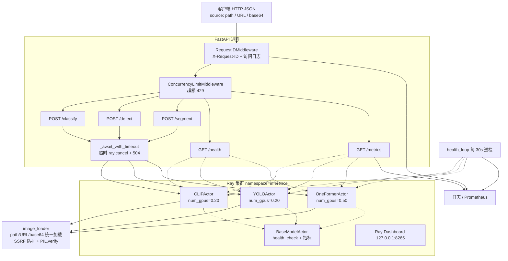

前面介绍了在[pytorch中不同的分布式训练实现方式](https://www.big-yellow-j.top/posts/2026/04/20/torch-basic-distribute-1.html)，这里简单介绍分布式框架（更加多的设计到了模型部署、服务器调度之间内容，非严格的pytorch内容）Ray以及Docker等内容。

## 前置知识

### Docker

### FastAPI

### 异步

## Ray

一句话介绍Ray：主要是进行分布式计算 / 并行计算的开源框架，核心目标是：让你用“写本地 Python 的方式”，轻松把程序扩展到多台机器上运行。**不过**Ray只负责管理核心计算还是Pytorch进行。

Ray 架构介绍

参考官方v2架构说明[^2]简单介绍Ray架构设计：


Ray 的架构可以拆解为五个核心组件，它们各司其职、协同工作。

#### 1. Node 组件：Head Node 与 Worker Node

Ray 集群由两类节点组成：

- **Head Node（头节点）**：集群的"大脑"。除了运行工作负载外，它还负责管理集群的全局状态（通过 GCS）、调度任务、运行 Dashboard 和 Autoscaler。它是集群中唯一知道所有节点信息的节点。
- **Worker Node（工作节点）**：集群的"手脚"。不参与全局决策，只负责接收 Head Node 分配的任务并执行。每个 Worker Node 上运行一个 Raylet 进程，负责本地的任务调度和资源管理。

> 可以把 Head Node 理解为建筑工地的总指挥，Worker Node 是各个工种的施工队——总指挥分配任务，施工队埋头干活。

#### 2. Scheduler（调度器）

Ray 采用**自底向上的分布式调度**策略，调度逻辑分散在两层：

- **Global Scheduler（全局调度器）**：运行在 Head Node 的 GCS 中。它维护全局资源视图（哪个节点有空闲 GPU/CPU/内存），当本地调度器无法满足任务时接管调度。
- **Local Scheduler（本地调度器，即 Raylet）**：每个节点一个。优先在本地满足任务请求（减少数据传输），只有本地资源不足时才把任务"上报"给全局调度器。

这种设计避免了传统中心化调度的瓶颈——大多数任务的调度决策在本地就完成了，延迟极低。

#### 3. Object Store（分布式对象存储）

Ray 基于 Apache Arrow / Plasma 实现了**内存中的分布式对象存储**，是 Ray 高性能的关键：

- 每个节点上运行一个 Object Store 进程（`plasma_store`），通过共享内存提供零拷贝的数据访问。
- 同一节点上的多个 Worker 进程可以通过共享内存直接读写同一份对象，无需序列化/反序列化。
- 跨节点的数据传输是**惰性的**——只有当某个节点的 Worker 真正需要某个对象时，才会从其他节点拉取。

> 举个直观的例子：Worker A 在节点 1 上产生了一个 10GB 的 tensor，Worker B 在同一节点上可以直接"看到"它，就像两个线程共享同一块内存一样。

#### 4. Global Control Store（GCS，全局控制存储）

GCS 是 Ray 的**分布式键值存储**，运行在 Head Node 上，是整个系统的"中枢神经系统"：

- **存储集群元数据**：节点列表、存活状态、资源总量。
- **存储系统状态**：哪些 Actor 在哪个节点、函数定义、对象的位置信息（存储在哪个节点的 Object Store 上）。
- **提供 Pub/Sub 机制**：当某个事件发生时（如节点故障、Actor 创建/销毁），GCS 会通知订阅者。

GCS 本身是一个 Redis-like 的 KV 存储，所有组件通过它与集群的"全局知识"交互。

#### 5. Raylet

Raylet 是运行在**每个节点**上的守护进程（用 C++ 实现），是节点级的"管家"，负责三件事：

| 职责               | 说明                                                         |
| ------------------ | ------------------------------------------------------------ |
| **本地调度** | 从 GCS 拉取任务队列，根据本地资源状态分配给 Worker           |
| **资源管理** | 跟踪本节点 CPU/GPU/内存的实时使用情况，向 GCS 汇报           |
| **对象管理** | 管理本地 Object Store 中的对象生命周期（引用计数、淘汰策略） |

Raylet 的设计理念是"让每个节点自治"——即使 Head Node 暂时不可达，Worker Node 上的 Raylet 依然能继续调度本地的任务和执行中的 Actor。**简单任务介绍一下上述过程**：比如说使用Ray进行**贝叶斯调参过程**，假设我们一块CPU假设32个核心我们并行4组参数执行，每组任务拥有5个核心，那么此时我们就有**4个Worker node**，**Head Node内部处理过程**：去控制每次贝叶斯下一次的参数（比如说RF中节点数量等）那么此时计算出4组优化参数（如n、depth等），通过**GCS**（比如说告诉目前迭代轮次、指标等） **将任务写入队列**，**Scheduler** 根据资源视图把任务分配到 4 个 Worker。每个**Worker内部处理过程** ：各 Worker 的 Raylet 分配 5 个核，启动训练 → 结果写入本地 Object Store。 **Head Node** 拿到 4 个准确率 → 更新 GCS 中的历史记录 → 贝叶斯优化器计算下一轮参数 → 循环。

> 对于**普通训练过程**可能是：初始化参数-->进行参数计算得到效果-->贝叶斯优化器决定下一组参数-->循环

### 架构与编程接口的关系

在继续之前，先澄清一个关键问题：**Ray 架构**和 **Ray Core** 是什么关系？

简单说：**架构是"幕后"（运行时怎么跑），Ray Core 是"台前"（你怎么写代码）**。在用 Ray Core 的 Task、Actor、Object 写程序，底层架构自动调度执行。对应关系如下：

| 代码（Ray Core）         | 幕后发生了什么（Ray 架构）                                                             |
| ------------------------ | -------------------------------------------------------------------------------------- |
| `@ray.remote` 装饰函数 | 函数定义被注册到**GCS**，集群中所有节点都知道这个函数                            |
| `func.remote(args)`    | **Scheduler** 从 GCS 拿到任务，找到空闲 **Worker Node**，分配过去执行      |
| `@ray.remote class`    | GCS 创建一个**Actor** 记录，**Raylet** 在某节点上启动并管理这个 Actor 进程 |
| `ray.put(data)`        | 数据写入当前节点的**Object Store**，返回引用存到 GCS                             |
| `ray.get(ref)`         | 从 GCS 查到数据在哪个节点的 Object Store，惰性拉取                                     |
| `train.report(...)`    | 指标通过 GCS 的 Pub/Sub 广播给 Head Node                                               |

> 打个比方：Ray Core 是你手中的方向盘和油门，Ray 架构是引擎盖下的发动机、变速箱和传动轴。你不需要知道齿轮怎么转，但理解了能帮你写出更高效的代码。

有了这个映射，下面看 Ray 的四层库就很容易理解——它们都是 Ray Core 的上层封装。

#### Ray Core

Ray Core 是 Ray 的**底层编程接口**，提供了最基础的分布式原语。上面提到的 Ray Data、Ray Train、Ray Tune 都是构建在 Ray Core 之上的。初学时只需要掌握三个核心概念：

**① Task（远程函数）**

把一个普通 Python 函数变成可以在集群任意节点上并行执行的"任务"：

```python
import ray

@ray.remote            # 装饰器：将函数注册为 Ray Task
def train_rf(n_estimators, max_depth):
    from sklearn.ensemble import RandomForestClassifier
    model = RandomForestClassifier(n_estimators=n_estimators, max_depth=max_depth)
    model.fit(X_train, y_train)
    return model.score(X_val, y_val)

# 发起 4 个并行任务（非阻塞，立即返回 ObjectRef）
results = [train_rf.remote(n, d) for n, d in param_combinations]
# 阻塞等待所有结果
scores = ray.get(results)
```

对应到架构：`@ray.remote` 装饰的函数被 GCS 记录，调用 `.remote()` 时 Scheduler 将任务分配到空闲 Worker，返回值通过 Object Store 传递。

**② Actor（有状态的工作者）**

Task 是无状态的（每次调用独立），而 Actor 是**有状态的长期运行的 Worker**。比如需要一个持续更新的贝叶斯模型：

```python
@ray.remote
class BayesianOptimizer:
    def __init__(self, param_space):
        self.history = []          # 状态：历史 (参数, 分数)
        self.optimizer = ...       # 贝叶斯优化器实例
  
    def suggest(self, n=4):
        """根据历史返回下一组候选参数"""
        return self.optimizer.ask(n)
  
    def update(self, params, score):
        """用新结果更新模型"""
        self.history.append((params, score))
        self.optimizer.tell(params, score)

# 创建一个 Actor（运行在某个 Worker Node 上）
optimizer = BayesianOptimizer.remote(param_space)
```

对应到架构：Actor 被 GCS 管理生命周期，Raylet 负责在所在节点为其分配资源和调度其方法调用。

**③ Object（分布式对象引用）**

`ray.put()` 把数据放入 Object Store，返回一个 `ObjectRef`（类似指针）。`ray.get()` 从任何节点拉取数据：

```python
data_ref = ray.put(large_dataset)   # 放入本地 Object Store，返回引用
# 任何节点上的 Worker 都可以：
data = ray.get(data_ref)            # 惰性拉取，零拷贝共享内存
```

对应到架构：这就是前面 Object Store 部分讲到的——同节点共享内存零拷贝，跨节点惰性传输。

> **一句话总结 Ray Core**：`@ray.remote` 把函数/类变成可分布式执行的 Task/Actor，`ObjectRef` 让数据在集群中透明流转。理解了这三者，就理解了 Ray 的编程基础。

## Ray实战
### 模型部署

考虑将优化好的模型进行服务器部署，那么就需要考虑如下几个问题：**1、资源使用**，比如说对于每一个模型如何去划分他所需要的资源；**2、服务可靠性**，比如说我的节点挂掉了能不能自动恢复；**3、可观测结果**，比如说我需要监控模型的运行情况，比如说模型的运行时间，模型的运行结果等等；**4、部署**，考虑到k8s/docker部署就需要去完成对应优化；**5、服务安全**，比如 Ray Dashboard监控面板不可能让他暴露公网。**具体到实际应用**比如说服务器上部署如下几个模型：1、CLIP进行图像分类；2、Yolo进行目标识别（这里直接用v8）；4、oneformer-large进行实体分割。那么**整体结构**如下：



**首先确定我们每一个节点服务**，因为所有的服务都是一样的都去加载模型然后进行模型推理，因此可以直接创建一个 `BaseModelActor`而后让其他模型去继承即可，对于这个**基类设计**：1、模型加载/推理/warm-up（让模型直接“常驻”显存避免每次都去加载）等（不会去基类里面具体写如何加载模型因为每个模型加载/推理方式不同）；2、记录模型状态（或者说“健康检测”），比如说去记录模型显卡、推理时间等。**具体节点设计**（以CLIP为例）。**对所有节点进行部署。**

**而后确定服务**，这块主要是FastAPI

#### 服务启动与监控

启动一般而言分为两种，直接一键启动以及热启动（只去修改代码不去改模型，避免每次都要重启服务）

* **1、一键启动(生产 / 临时跑通)**

```bash
pip install-rrequirements.txt
CUDA_VISIBLE_DEVICES=0 pythonmain.pyserve --port 7890
```

`main.py serve` 内部依次:启动 Ray → 创建三个 detached actor(自动加载模型权重)→ 装配 FastAPI → uvicorn 运行。一个进程包圆,Ctrl+C 整套退出。

* **2、热重载开发**

把 Ray 集群和 API 进程解耦:Ray actor 常驻不动,只重启 uvicorn。三步:

```bash
# 1) 启 Ray 集群(一次性,后续不动)
CUDA_VISIBLE_DEVICES=0 ray start --head --dashboard-host =127.0.0.1
# 2) 创建/确保 detached actor 就绪(一次性,模型权重在此加载)
python main.py bootstrap
# 3) 启 API 进程,代码改动自动重载(模型不会被重载)
uvicorn ray_deploy:app --host 0.0.0.0 --port 7890 --reload --reload-dir services --reload-dir models
```

之后改 `services/` 或 `models/` 下的代码,uvicorn 秒级重启 API 进程,但 actor 进程不动 —— **模型权重无需重新加载**(OneFormer-large 加载一次 ~30s,这个差距很大)。API 进程的 FastAPI startup hook 会自动 `ray.init(address="auto")` attach 已存在的集群,并通过 `ray.get_actor(name)` 拿到 bootstrap 阶段创建的 actor 句柄。如果有些时候**对模型进行了替换只需要执行**:

```bash
# 仅替换模型（Ray 集群 + API 进程均不受影响） 可以直接新的终端执行即可
python main.py teardown        # 杀掉 detached actor
python main.py bootstrap       # 用新权重重建 actor
# 完全关闭（开发结束后）
# 先 ctrl+c 停 uvicorn，再：
ray stop
```

在热启动中执行第一段命令之后


本地会启动8625端口直接可以去访问ray dashboard面板（目前只是启动Ray服务，所有模型都还没有加载），而后执行第二条命令去加载所有的服务就可以看到所有actor信息日志等，除此之外对于ray本地日志：

* Actor 内部日志(每个模型独立) → `/tmp/ray/session_latest/logs/worker-*.out|.err`

* Ray 系统日志(raylet/gcs/dashboard) → `/tmp/ray/session_latest/logs/`


最后命令启动服务：

#### 服务调用
在启动服务之后可以直接访问`http://localhost:7890/docs#`就可以看到所有服务并且可以直接去里面看到所有服务参数，这里直接使用 `postman`进行服务调用并且去看测试结果比如说要去使用**分类测服务**可以直接：**1、首先去 `docs`中去看我的请求参数是什么**

**2、而后直接去postman中发送请求即可**（里面的脚本都是JavaScript）


## 参考
[^1]: [https://docs.rayai.org.cn/en/latest/index.html](https://docs.rayai.org.cn/en/latest/index.html)
[^2]: [Ray v2 Architecture](https://docs.google.com/document/d/1tBw9A4j62ruI5omIJbMxly-la5w4q_TjyJgJL_jN2fI/preview?tab=t.0#heading=h.iyrm5j2gcdoq)