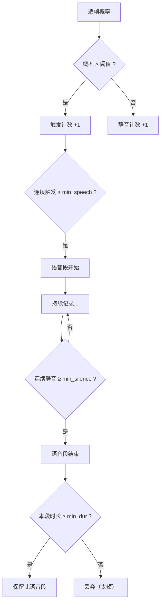
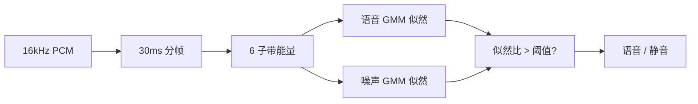
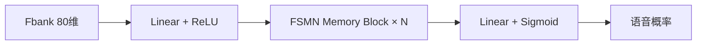

## VAD模型简要概述
VAD 的核心任务是 **判断一段音频中哪些时间段有人说话哪些时间段没有人说话** ，也就是区分语音和非语音（或静音）部分。想象一下，在一个有背景噪音的环境中，VAD 就像一个智能“守门人”，它能准确识别什么时候有人在说话，什么时候是纯粹的环境噪音或沉默。
### VAD模型工作原理
**音频数字化过程**：声音通过震动转化为电压的模拟信号，但是电脑只能处理数字信号（01等），因此在数字化信号处理过程中通过ADC（模数转换器）进行处理，其主要是如下几件事情：**1、采样**每隔固定时间测量一次声音幅度，常用指标 *Hz*表示每秒采样多少声音副本（常用的8Hz、16Hz）；**2、量化**采样后数值结果是一批连续点，但是计算机存储数据范围有限如8bit就只有 `2^8=256`因此需要将数值进行量化处理如 `0.123456V-->37`，常用指标为 *位深*如8bit、16bit等；实际代码去理解音频处理过程（*以模型训练中数据加载进行理解*），在[测试音频](https://datasets-server.huggingface.co/cached-assets/edinburghcstr/ami/--/46f28f2503e2ec48f8867a84eef356c70476beab/--/ihm/train/50/audio/audio.wav?Expires=1784359125&Signature=svrspzw2YN9rWfF4o6DYYXf96iKc7qB~zVVwZ6XpODe4leVgGVb9tNW8wooOguZVR-mPeGVnWiUhOGfkmwCZTJFYHV4q98U4hGJasBxkN1jA-wXpvUp0WrQoN173pIrjhHvwnRmPmhlqvNOhGu22HYCsOId1PJDw2-1Tr8vWvkg8d4CGtTkL1k9nax7UHqFjkv9Qml5CxW-raSAAwtV4H9vmUX0WZVkDPsYkRcfP54SpUL4XPxTGI1S2DOTDerhw-ikcEwJDV-E8r8frX5HdjyvnJqqX7Xx1wtVTkDmDwjCbMvxURtjGnfxuFZ5QsJDaguoy0qeN8hogl0A~NqOyKA__&Key-Pair-Id=KII6SEJ68IEHF)中通过绘制出波形图、Mel频谱图：

其中在**波形图**中，X 轴 = 时间，Y 轴 = 振幅（空气振动强度），密集振荡的区域 → 有声音，平坦区域 → 静音。在**Mel频谱图**中：X轴 = 时间，Y 轴 = Mel 频率（人耳感知的频率刻度，低频分辨更精细），颜色 = 能量 (dB)。它将一维时序信号变成二维热力图，同时展示什么频率在什么时候出现。
> **Mel 频谱图计算过程：**
> **Step 1 — 预加重 (Pre-emphasis)**：$y_t' = y_t - \alpha \cdot y_{t-1}$（$\alpha \approx 0.97$），增强高频分量，补偿发声时声门和嘴唇对高频的衰减。
> **Step 2 — 分帧 (Framing)**：将一维信号切成重叠的小段。每帧长度通常 20~40ms（如 16kHz 下 512 点 = 32ms），帧移通常 10ms（如 160 点）。帧与帧之间有重叠，保证时间上的连续性。
> **Step 3 — 加窗 (Windowing)**：对每帧乘以汉明窗或汉宁窗，减少分帧带来的频谱泄漏（边缘截断效应）：$x_n^{windowed} = x_n \cdot w_n$。
> **Step 4 — STFT / FFT**：对每帧做短时傅里叶变换，得到该帧的**功率谱**：$P = |\text{FFT}(x)|^2$。此时得到的是线性频率刻度上的能量分布。
> **Step 5 — Mel 滤波器组 (Mel Filterbank)**：人耳对低频的分辨能力远高于高频。将线性频率 $f$（Hz）映射到 Mel 刻度：
> $$m = 2595 \cdot \log_{10}\left(1 + \frac{f}{700}\right)$$
> 用 $N$ 个三角形滤波器（如 80 个）在 Mel 刻度上等距排列，对功率谱加权求和，得到 $N$ 维的 Mel 能量向量。
> **Step 6 — 转 dB (Log Compression)**：$\text{Mel}_{\text{dB}} = 10 \cdot \log_{10}\left(\frac{\text{Mel}}{\text{ref}}\right)$，取对数压缩动态范围，也更贴近人耳对响度的对数感知特性。最终得到一个 `(n_mels × n_frames)` 的二维矩阵——即 Mel 频谱图。

回到VAD模型处理过程中，理想的VAD模型效果就是在上述波形图中找到静音区域（尽量不受到背景噪音的干扰）然后切分出来（亦或者从Mel图中剔除掉db小的内容）
### 前置知识

理解了上面的 Mel 频谱图计算过程后，我们还需要掌握几个贯穿所有 VAD 模型的核心概念，才能理解后面每个模型的参数为什么这样设计、该怎样调。

#### 一、采样率（Sample Rate）

采样率 = 每秒采集多少个声音振幅的"快照"，单位 Hz。16kHz 意味着每秒在波形上取 16,000 个点。

为什么 VAD 几乎全是 16kHz？

- 人类语音主要能量集中在 **300Hz ~ 3.4kHz**（电话频带）。根据奈奎斯特定理，采样率 ≥ 语音最高频率 × 2 即可完整保留信息，所以 8kHz 就够了。
- 但 16kHz 能保留到 8kHz 的高频泛音（齿音、摩擦音等），这些对语音清晰度和 VAD 判断有帮助，而 44.1kHz/48kHz 的超声波段对 VAD 无意义只会增加计算量。
- 16kHz 是语音处理领域的黄金平衡点——信息完整、计算友好。

#### 二、位深（Bit Depth）

位深 = 每个采样点用多少 bit 存储振幅值。8bit → $2^8=256$ 个可能值，16bit → $2^{16}=65,\!536$ 个。16bit 是音频处理的标配——能表达从耳语到呐喊的动态范围而不过载或淹没在量化误差里。

#### 三、分帧：帧长、帧移与重叠

**为什么分帧？** 语音是非平稳信号，频率成分随时间剧烈变化。直接对整段 10 秒音频做傅里叶变换会丢失所有时间信息——你不知道哪个频率发生在第几秒。所以在 Mel 频谱图计算的 Step 2 中，我们把长音频切成几十毫秒的小片段（帧），假设每帧内信号近似平稳，对每帧分别分析。

两个关键参数：

| 概念 | 典型值 | 含义 |
|------|--------|------|
| **帧长 (Frame Length / Window Size)** | 20~40ms（16kHz 下 320~640 点） | 每次分析截取多长的音频片段。太长 → 时间分辨率差（变化捕捉迟钝），太短 → 频率分辨率差 |

例如 FSMN-VAD 的 `frame_out_ms=25`（帧长 25ms）、`frame_in_ms=10`（帧移 10ms），WebRTC VAD 固定 30ms 帧长。

| 概念 | 典型值 | 含义 |
|------|--------|------|
| **帧移 (Hop Length / Frame Shift)** | 10ms（16kHz 下 160 点） | 相邻两帧起点间隔多少毫秒。帧移 < 帧长 → 帧之间有**重叠**，保证时间连续性，避免遗漏帧边界处的语音变化 |
| **重叠 (Overlap)** | 帧长 − 帧移 | 重叠越大 → 时间分辨率越高，但计算量也越大 |

```
帧长 25ms, 帧移 10ms:
|========帧0========|
          |========帧1========|
                    |========帧2========|
                              ...
|<-- 10ms -->|
```

#### 四、特征：STFT 功率谱 vs Fbank（梅尔滤波器组能量）

不同 VAD 模型使用的输入特征不同，理解它们的区别很重要：

| 特征 | 维度 | 谁在用 | 特点 |
|------|------|--------|------|
| **STFT 功率谱** | 257 维/frame（16kHz, 512 点 FFT） | Silero VAD | 线性频率刻度，保留全部频域细节 |
| **Fbank (Filterbank)** | 80 维/frame（80 个 Mel 滤波器） | FSMN-VAD、FireRedVAD | Mel 刻度 + 三角滤波压缩，维度低、去冗余、更贴合人耳 |

Fbank 就是 Mel 频谱图计算过程的 Step 1~5（跳过 Step 6 转 dB），得到的是 80 维能量值而非 dB。两者没有绝对的优劣：功率谱信息完整但维度高、冗余多；Fbank 压缩了维度，语音信息密度更高、模型更容易训练。

#### 五、分贝（dB）：为什么用对数尺度

音频处理中几乎处处用 dB 而不是线性能量值，原因有两条：

1. **人耳对数感知**：声压 10 倍 → 听感约 2 倍响。dB 就是对能量取对数，匹配人耳特性。
2. **压缩动态范围**：耳语和呐喊的能量差可达 $10^6$ 倍，线性值下小信号完全被淹没。转 dB 后变成 60dB 差距，算法更好处理。

两个常用 dB 公式：

$$\text{功率比 dB} = 10 \cdot \log_{10}\left(\frac{P}{P_{\text{ref}}}\right) \quad \text{振幅比 dB} = 20 \cdot \log_{10}\left(\frac{A}{A_{\text{ref}}}\right)$$

能量 VAD 中的 `threshold_db=-30` 意思是：帧 RMS 能量比最大 RMS 低 30dB 以下算静音。−30dB 约等于最大能量的 1/32，是一个比较保守的静音阈值。

#### 六、VAD 后处理：滞后机制（Hysteresis）

这是理解 VAD 参数最核心的概念。模型输出的逐帧概率（0 或接近 1 = 语音，0 或 接近 0 = 静音）往往伴随频繁跳变——一帧语音、一帧静音、一帧语音……这是因为：

- 词语之间的短暂停顿（"今天——天气——很好"）
- 爆破音/塞音的瞬时低能量段
- 模型自身的抖动

直接按帧级概率切分会得到大量碎片。所有 VAD 都会用一套**滞后（Hysteresis）机制**来平滑：



对应的常见参数（不同模型叫法略有不同）：

| 参数 | 含义 | 调大效果 | 调小效果 |
|------|------|-----------|-----------|
| `threshold` / `speech_threshold` | 单帧判为语音的概率/能量门槛 | 更保守（更少判语音） | 更激进（更多判语音） |
| `min_speech_duration_ms` | 连续多少毫秒判语音才确认"语音段开始" | 过滤短噪音导致的误触发 | 更快响应，但可能误触发 |
| `min_silence_duration_ms` | 连续多少毫秒静音才确认"语音段结束" | 语音段更长（容忍更长的句中停顿） | 语音段更短，句中停顿即切分 |
| `speech_pad_ms` | 在语音段首尾额外多保留多少毫秒 | 避免切掉开头/结尾，语音段更完整 | 边界更精确，但可能截断尾音 |

这四个参数的组合决定了 VAD 的**激进程度**——是宁可多切（保守，漏语音少但杂音多）还是宁可不切（激进，杂音少但可能漏语音）。

#### 七、端点检测（Endpoint Detection）

FSMN-VAD 参数中大量的 `start_point`、`end_point`、`lookback`、`lookahead` 参数，就是端点检测的具体实现。核心思想与滞后机制一致，但更精细：

- **起点检测**：连续 N 帧判语音后才标记起点，可以回溯（`lookback_time_start_point`）补回触发前的部分，避免切掉辅音开头
- **终点检测**：连续 M 帧静音后才标记终点，可以提前（`lookahead_time_end_point`）减少延迟
- **双阈值 (Dual Threshold)**：某些实现（如 FSMN-VAD 的 `speech_noise_thresh_low/high`）用高阈值确认"有语音"，用低阈值确认"语音结束"，防止能量波动导致反复切换

#### 八、其他参数速查

| 概念 | 出现在 | 含义 |
|------|--------|------|
| **SNR (信噪比)** | FSMN-VAD | 语音能量 / 噪声能量，< 阈值则判噪声，用于筛除能量低但噪音大的帧 |
| **chunk / 分块推理** | FireRedVAD、FSMN-VAD | 将长音频切成固定时长（如 30,000 帧）逐块推理，控制显存/内存占用 |
| **平滑窗口 (Smooth Window)** | FireRedVAD | 对连续 N 帧的概率取平均，消除单帧抖动 |
| **CMVN (倒谱均值方差归一化)** | FireRedVAD | 对 Fbank 特征做零均值单位方差归一化，消除信道/录音设备差异 |

有了这些前置知识，再看下面每个模型的参数表，就能理解每个参数控制的是哪一步、调大会产生什么效果。
## 常用VAD模型架构
### WebRTC VAD — 高斯混合模型 (GMM)
Google 在 WebRTC 项目中开源的经典 VAD [^1]，浏览器内置，极轻量零依赖，是实时通信场景的事实标准。采用纯信号处理方法，无需神经网络。
#### 模型结构
**特征提取**[^1]：每帧提取 6 个子带（80Hz~4kHz 按对数刻度划分）的能量，得到一个 6 维特征向量。
**模型结构**：每个子带用 **2 个高斯分布** 分别建模语音和噪声的能量分布，共 12 个高斯分量。对每帧的 6 维特征向量，计算其在语音 GMM 和噪声 GMM 下的似然比：

$$\text{LLR} = \log \frac{P(\mathbf{x} \mid \text{语音})}{P(\mathbf{x} \mid \text{噪声})} = \sum_{k=1}^{6} \log \frac{\mathcal{N}(x_k; \mu_k^s, \sigma_k^s)}{\mathcal{N}(x_k; \mu_k^n, \sigma_k^n)}$$

LLR > 阈值则判为语音帧。GMM 参数通过 EM 算法离线训练，推理仅需查表 + 指数运算。


#### 模型使用

| 参数 | 默认值 | 含义 |
|------|--------|------|
| `aggressiveness` | `2` | 激进程度（0~3），越大越容易判为语音 |

```python
from AudioVADProcess import VADProcess

vad = VADProcess.create("webrtc", aggressiveness=2)
segments = vad.detect("audio.wav")
```

### Silero VAD — CRNN（CNN + GRU）
Silero 团队开源的企业级 VAD [^2]，训练数据覆盖 6000+ 语种，模型仅 2MB，单 CPU 线程 <1ms/帧，社区最活跃的开源 VAD（GitHub 9.6k Stars）。
#### 模型结构
**特征提取**[^2]：输入 16kHz 音频 → 512 点 STFT（32ms 窗，10ms 帧移）→ 257 维功率谱。
**模型结构**（前向计算流）：

```
STFT (257, T)
  ↓
Conv1d(k=3, 257→128) + ReLU
  ↓
Conv1d(k=3, 128→64) + ReLU
  ↓
2× GRU(hidden=64, bidirectional)
  ↓
Linear(128→1) + Sigmoid
  ↓
每帧语音概率 ∈ [0, 1]
```

CNN 负责提取局部时频模式（如共振峰、谐波结构），双向 GRU 捕捉前后时间上下文（如语音段边界过渡），最后 Sigmoid 输出逐帧概率。总参数约 **2MB**，纯 PyTorch JIT，可导出 ONNX。
#### 模型使用

| 参数 | 默认值 | 含义 |
|------|--------|------|
| `use_onnx` | `False` | 是否使用 ONNX 推理（需 `onnxruntime`） |
| `threshold` | `0.5` | 语音概率阈值（0~1），高于此值判为语音 |
| `min_speech_duration_ms` | `250` | 最短语音持续（毫秒），短于此的片段被过滤 |
| `min_silence_duration_ms` | `100` | 最短静音间隔（毫秒），小于此的间隔被合并 |
| `speech_pad_ms` | `30` | 语音段首尾填充（毫秒），避免切掉开头结尾 |

```python
from AudioVADProcess import VADProcess

vad = VADProcess.create("silero", threshold=0.6, min_speech_duration_ms=300)
segments = vad.detect("audio.wav")
```


### FSMN-VAD — 前馈序列记忆网络
阿里达摩院在 FunASR 中开源的 VAD 模块 [^3]，基于前馈序列记忆网络（FSMN），专为中英文语音场景优化，仅 0.4M 参数。
#### 模型结构
**特征提取**[^3]：80 维 Fbank（梅尔滤波器组能量），帧长 25ms，帧移 10ms。
**模型结构**：FSMN 的核心思想是在标准前馈网络（FFN）的隐藏层中插入 **可学习的记忆模块 (Memory Block)**：

$$\tilde{h}_t = h_t + \sum_{i=0}^{N} a_i \odot h_{t-i} + \sum_{j=1}^{M} c_j \odot h_{t+j}$$

其中 $h_t$ 是当前帧的隐藏向量，$a_i, c_j$ 是前向/后向记忆权重。相比 LSTM/GRU，FSMN 无需序列化递归计算，所有帧可并行前向传播，训练和推理都更快。



FSMN-VAD 仅 **0.4M 参数**，是当前最小的高精度 VAD。

#### 模型使用
**音频特征参数：**

| 参数 | 默认值 | 含义 |
|------|--------|------|
| `sample_rate` | `16000` | 音频采样率（Hz） |
| `frame_in_ms` | `10` | 帧移（ms），每帧间隔 |
| `frame_out_ms` | `25` | 帧长（ms），每帧包含的音频时长 |
| `window_size_ms` | `200` | 推理滑动窗口长度（ms） |

**端点检测参数：**

| 参数 | 默认值 | 含义 |
|------|--------|------|
| `detect_mode` | `0` | 检测模式，`1` 更严格，`0` 更宽松 |
| `do_start_point_detection` | `True` | 是否启用语音起点检测 |
| `do_end_point_detection` | `True` | 是否启用语音终点检测 |
| `max_start_silence_time` | `0` | 起点前最大静音（ms），`0` 不限制 |
| `max_end_silence_time` | `0` | 终点后最大静音（ms），`0` 不限制 |
| `lookback_time_start_point` | `0` | 起点回溯时间（ms），防止切掉开头 |
| `lookahead_time_end_point` | `0` | 终点提前时间（ms），减少延迟 |
| `sil_to_speech_time_thres` | `150` | 静音→语音切换所需连续触发时长（ms） |
| `speech_to_sil_time_thres` | `150` | 语音→静音切换所需连续静音时长（ms） |
| `do_extend` | `1` | 是否延长语音段尾部，避免截断尾音 |

**分段控制：**

| 参数 | 默认值 | 含义 |
|------|--------|------|
| `max_single_segment_time` | `15000` | 单段最大时长（ms），超长自动切分 |

**噪声与能量门限：**

| 参数 | 默认值 | 含义 |
|------|--------|------|
| `snr_mode` | `0` | 信噪比模式，`0` 关闭，`1` 启用 |
| `snr_thres` | `−100` | 信噪比阈值（dB），低于此值判为噪声 |
| `noise_frame_num_used_for_snr` | `100` | SNR 估计所用噪声帧数 |
| `decibel_thres` | `−100` | 分贝阈值，低于此值的帧判为静音 |
| `speech_noise_thres` | `0.8` | 语音/噪声能量比阈值，控制噪声过滤灵敏度 |
| `speech_noise_thresh_low` | `−1` | 双阈值下限 |
| `speech_noise_thresh_high` | `1` | 双阈值上限 |
| `speech_2_noise_ratio` | `0.5` | 语音/噪声比例，越大越严格 |
| `fe_prior_thres` | `1e-4` | 特征能量先验阈值，小于此的帧直接判静音 |

**推理环境：**

| 参数 | 默认值 | 含义 |
|------|--------|------|
| `device` | `"cpu"` | 推理设备，`"cuda"` 或 `"cpu"` |

```python
from AudioVADProcess import VADProcess

vad = VADProcess.create("fsmn", speech_noise_thres=0.9, sil_to_speech_time_thres=100,
                        max_single_segment_time=10000, device="cuda")
segments = vad.detect("audio.wav")
```

### pyannote.audio — SincNet + LSTM + Self-Attention
法国 CNRS 开源的说话人日志工具包 [^4]，学术基准长期 SOTA，其语音活动检测（SAD）模块端到端从原始波形学习，无需手工特征。
#### 模型结构
**特征提取**：直接用 **SincNet** 从原始波形学习滤波器，无需 STFT：

$$g[n, f_l, f_h] = 2f_h \cdot \text{sinc}(2\pi f_h n) - 2f_l \cdot \text{sinc}(2\pi f_l n)$$

$f_l, f_h$ 是可学习的低/高频截止频率，相当于在频域学习一组带通滤波器。
**模型结构**：

```
原始波形 (1, T)
  ↓
SincNet (学习 64 个带通滤波器)
  ↓
2× LSTM (hidden=128, bidirectional)
  ↓
Multi-Head Self-Attention (4 heads)
  ↓
Linear(128→1) + Sigmoid
  ↓
逐帧语音概率
```

SincNet 替代手工 Fbank/STFT，端到端从波形学习；LSTM 建模长程时序依赖；自注意力聚合全局上下文，捕捉整段音频的语音分布模式。

#### 模型使用

| 参数 | 默认值 | 含义 |
|------|--------|------|
| `token` | `HF_TOKEN` 环境变量 | HuggingFace 访问令牌，需先接受[用户协议](https://hf.co/pyannote/voice-activity-detection) |

```python
from AudioVADProcess import VADProcess

vad = VADProcess.create("pyannote", token="hf_xxx")
segments = vad.detect("audio.wav")
```

### FireRedVAD
#### 模型结构
小红书开源的 VAD 模块 [^5]，输入为 80 维 Fbank 特征，经过 **CMVN 归一化** 后送入深度神经网络，输出每帧的语音概率。后处理用滑动窗口平滑 + 阈值 + 最小语音/静音帧数约束来合并相邻段。论文未完全公开模型细节，但基准测试中超越 Silero v6 [^2]。
#### 模型使用

| 参数 | 默认值 | 含义 |
|------|--------|------|
| `model_dir` | `pretrained_models/FireRedVAD/VAD` | 模型路径，首次自动下载 |
| `speech_threshold` | `0.4` | 语音概率阈值（0~1），低于此值判为静音 |
| `use_gpu` | `False` | 是否启用 GPU 推理 |
| `smooth_window_size` | `5` | 概率平滑窗口大小（帧数），减少抖动 |
| `min_speech_frame` | `20` | 最短语音持续帧数，短于此的片段被过滤 |
| `max_speech_frame` | `2000` | 最长语音持续帧数，超长自动切分 |
| `min_silence_frame` | `20` | 最短静音间隔帧数，小于此的间隔被合并 |
| `merge_silence_frame` | `0` | 合并间距帧数，相邻段间隔小于此值则合并 |
| `extend_speech_frame` | `0` | 向外扩展帧数，在语音段首尾各延伸 |
| `chunk_max_frame` | `30000` | 分块推理的最大帧数，控制显存/内存占用 |

```python
from AudioVADProcess import VADProcess

vad = VADProcess.create("firered", speech_threshold=0.5, min_speech_frame=30)
segments = vad.detect("audio.wav")
```


### 能量 VAD — RMS 阈值
最简单的 VAD 实现，仅依赖信号处理计算帧能量，零模型依赖、零网络请求、零额外存储，适合快速原型和噪声可控的环境。
#### 模型结构
最朴素的方法：计算每帧 RMS → 转 dB → 与固定阈值比较。

$$\text{RMS}_t = \sqrt{\frac{1}{N} \sum_{n=0}^{N-1} x_t[n]^2}, \quad \text{dB}_t = 20 \log_{10} \left( \frac{\text{RMS}_t}{\text{RMS}_{\max}} \right)$$

$\text{dB}_t > \theta$（如 −30dB）判为语音。零模型依赖，但阈值固定，无法应对动态噪声环境。

#### 模型使用

| 参数 | 默认值 | 含义 |
|------|--------|------|
| `threshold_db` | `−30` | 能量阈值（dB），高于此值判为语音 |
| `frame_ms` | `25` | 帧长（毫秒） |
| `hop_ms` | `10` | 帧移（毫秒） |
| `min_speech_ms` | `200` | 最短语音持续（毫秒），短于此的片段被过滤 |
| `min_silence_ms` | `300` | 最短静音间隔（毫秒），小于此的间隔被合并 |

```python
from AudioVADProcess import VADProcess

vad = VADProcess.create("energy", threshold_db=-25, min_speech_ms=100)
segments = vad.detect("audio.wav")
```

### auditok — 能量 + 频谱
基于能量和频谱特性的纯算法 VAD，Python 生态中轻量级音频切分工具，无需训练，开箱即用。
#### 模型结构
基于能量和频谱特性的传统信号处理方法。对音频流进行实时分帧，计算每帧短时能量，当能量连续超过阈值且持续足够时长时标记为语音段。核心逻辑为状态机：静音 → 检测到能量 → 语音段开始 → 能量持续低于阈值 + 静音超时 → 语音段结束。无需训练数据，纯算法实现。
#### 模型使用

| 参数 | 默认值 | 含义 |
|------|--------|------|
| `energy_threshold` | `50` | 能量阈值，高于此值视为有声音 |
| `min_dur` | `0.2` | 最短语音持续（秒），短于此的片段被过滤 |
| `max_dur` | `15` | 最长语音持续（秒），超长自动切分 |
| `max_silence` | `0.3` | 最大静音容忍（秒），静音超过此值则切分 |

```python
from AudioVADProcess import VADProcess

vad = VADProcess.create("auditok", energy_threshold=45, min_dur=0.5)
segments = vad.detect("audio.wav")
```


# 参考
[^1]: WebRTC VAD — <https://webrtc.googlesource.com/src/+/refs/heads/main/common_audio/vad/>
[^2]: Silero Team. "Silero VAD: pre-trained enterprise-grade Voice Activity Detector." GitHub, 2024. <https://github.com/snakers4/silero-vad>
[^3]: Gao Z. et al. "FunASR: A Fundamental End-to-End Speech Recognition Toolkit." INTERSPEECH, 2023. <https://arxiv.org/abs/2305.11013>
[^4]: Bredin H. "pyannote.audio 2.1 speaker diarization pipeline: principle, benchmark, and recipe." INTERSPEECH, 2023. Plaquet A., Bredin H. "Powerset multi-class cross entropy loss for neural speaker diarization." INTERSPEECH, 2023. <https://github.com/pyannote/pyannote-audio>
[^5]: Xu K. et al. "FireRedASR2S: A State-of-the-Art Industrial-Grade All-in-One Automatic Speech Recognition System." arXiv:2603.10420, 2026. <https://github.com/FireRedTeam/FireRedASR2S>