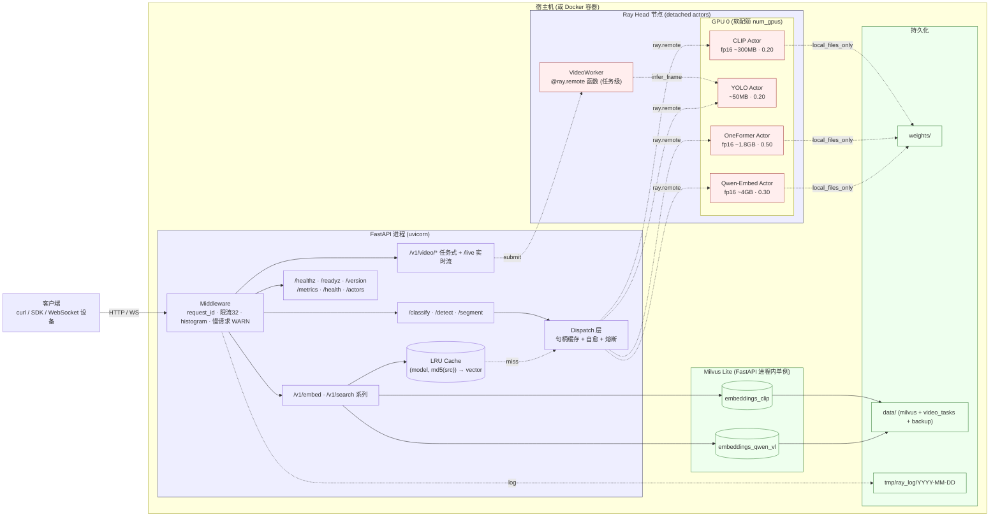

## Ray实战
> 代码待补充
### 模型部署工程化问题
考虑将优化好的模型进行服务器部署，那么就需要考虑如下几个问题（**仅为娱乐项目**）：**1、资源使用**，比如说对于每一个模型如何去划分他所需要的资源；**2、服务可靠性**，比如说我的节点挂掉了能不能自动恢复；**3、可观测结果**，比如说我需要监控模型的运行情况，比如说模型的运行时间，模型的运行结果等等；**4、部署**，考虑到k8s/docker部署就需要去完成对应优化；**5、服务安全**，比如 Ray Dashboard监控面板不可能让他暴露公网。**具体到实际应用**比如说服务器上部署如下几个模型：1、CLIP进行图像分类；2、Yolo进行目标识别（实时目标识别）；4、oneformer-large进行实体分割。那么**项目整体结构**如下：



#### 解决问题1：构建模型节点
**首先确定我们每一个节点服务**，因为所有的服务都是一样的都去加载模型然后进行模型推理，因此可以直接创建一个 `BaseModelActor`而后让其他模型去继承即可，对于这个**基类设计**：1、模型加载/推理/warm-up（让模型直接“常驻”显存避免每次都去加载）等（不会去基类里面具体写如何加载模型因为每个模型加载/推理方式不同）；2、记录模型状态（或者说“健康检测”），比如说去记录模型显卡、推理时间等。**具体节点设计**（以CLIP为例），只需要对我们的节点[补充一个Ray修饰器](#ray-core)即可：
```python
@ray.remote(
    max_restarts=ACTOR_MAX_RESTARTS,
    max_task_retries=ACTOR_MAX_TASK_RETRIES,
    max_concurrency=ACTOR_MAX_CONCURRENCY,
)
class CLIPActor(BaseModelActor):
    def __init__(self):
        super().__init__(model_name="CLIP", gpu_fraction=GPU_FRACTION_CLIP)

    def _load_model(self):
        ...
    def _warm_up(self):
        ...
    def infer():
        ...
```
在设计actor过程中语法就和平时模型推理相同（定义模型加载、模型推理）唯一差异在于用一个装饰器去对节点就行处理，在完成所有节点设计之后就只需要将**所有节点进行Ray部署即可**（[ray初始化过程](#简单使用)）。
#### 服务启动与监控
启动一般而言有如下几种，直接一键启动、热启动（只去修改代码不去改模型，避免每次都要重启服务）、docker方式启动

* **1、一键启动(生产 / 临时跑通)**

```bash
CUDA_VISIBLE_DEVICES=0 python main.py serve --port 7890
```
一个进程拉起 Ray 迷你集群 + 4 个 actor + FastAPI。Ctrl+C 整套退出(`SIGTERM` 会等 inflight)。

* **2、热重载开发**

把 Ray 集群和 API 进程解耦:actor 常驻,只重启 uvicorn。OneFormer-large 加载一次 ~30s,这个差距很大。

```bash
# 1) 启 Ray 集群(一次性)
CUDA_VISIBLE_DEVICES=2 ray start --head --dashboard-host=127.0.0.1 --dashboard-port=8265
# 2) 创建/确保 detached actor 就绪(一次性,模型权重在此加载)
python main.py bootstrap
# 3) 启 API 进程,改代码自动重载
uvicorn ray_deploy:app --host 0.0.0.0 --port 7890 --reload --reload-dir services --reload-dir models
```
> 有些时候如果模型没有下载/网速慢不影响具体代码使用可以在 `bootstrap` 执行之后如果有些模型一直在下载/加载不影响 `uvicorn` 启动（可以新建终端启动服务即可）。

之后改 `services/` 或 `models/` 下的代码,uvicorn 秒级重启 API 进程，但 actor 进程不动也就是说**模型权重无需重新加载**。API 进程的 FastAPI startup hook 会自动 `ray.init(address="auto")` attach 已存在的集群,并通过 `ray.get_actor(name)` 拿到 bootstrap 阶段创建的 actor 句柄。如果有些时候**对模型进行了替换**:

```bash
# 如果仅替换模型（Ray 集群 + API 进程均不受影响） 可以直接新的终端执行如下两端命令即可
python main.py teardown        # 杀掉 detached actor
# 如果不想kill 所有actor直接kill指定actor即可
python -c "import ray
from config import RAY_NAMESPACE
ray.init(namespace=RAY_NAMESPACE)
ray.kill(ray.get_actor('clip', namespace=RAY_NAMESPACE), no_restart=True)
print('killed clip')
"

python main.py bootstrap       # 用新权重重建 actor
# 如果要去完全关闭（开发结束后）先 ctrl+c 停 uvicorn，再去停ray服务
python main.py teardown
ray stop
```

在热启动中执行第一段命令之后

本地会启动8625端口直接可以去访问ray dashboard面板（目前只是启动Ray服务，所有模型都还没有加载），而后执行第二条命令去加载所有的服务就可以看到所有actor信息日志等，除此之外对于ray本地日志：
* Actor 内部日志(每个模型独立) → `/tmp/ray/session_latest/logs/worker-*.out|.err`
* Ray 系统日志(raylet/gcs/dashboard) → `/tmp/ray/session_latest/logs/`


最后命令启动服务：

#### 服务调用
在启动服务之后可以直接访问`http://localhost:7890/docs#`就可以看到所有服务并且可以直接去里面看到所有服务参数，这里直接使用 `postman`进行服务调用并且去看测试结果比如说要去使用**分类测服务**可以直接：**1、首先去 `docs`中去看我的请求参数是什么**

**2、而后直接去postman中发送请求即可**（里面的脚本都是JavaScript）

### 模型训练