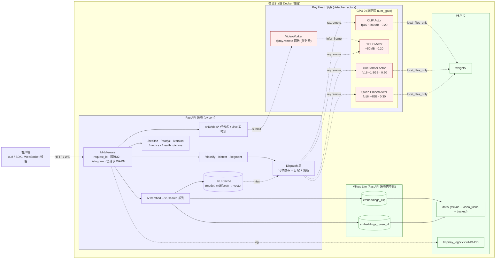

前面介绍了在[pytorch中不同的分布式训练实现方式](https://www.big-yellow-j.top/posts/2026/04/20/torch-basic-distribute-1.html)，这里简单介绍分布式框架（更加多的设计到了模型部署、服务器调度之间内容，非严格的pytorch内容）Ray以及Docker等内容。
## 前置知识 
所有内容只去介绍基本概念与使用，更加丰富的细节建议去看官方文档（或者直接AI）。docker文档[^3]、FastAPI[^4]
### 异步/多线程/多进程
**首先程序任务主要为两类**：*1、CPU 密集*：一直在"**算**"，CPU 满载（图片处理、模型推理、加密、大量计算）；*2、IO 密集*：大量时间在"**等**"（网络请求/读写文件）。而对于异步/多线程/多进程可以简单理解为（以餐厅服务多人为例）：一个服务员等菜的时候去别的桌子（*异步*）、多个服务员当时公用一个厨师（*多线程*）、直接开多家餐厅（*多进程*）
> 进程好理解，在python有 GIL（全局解释器锁），同一时刻只有一个线程能执行 Python 代码，因此对于多线程和异步（两个都是处理IO密集的）使用“差异不大”，如果并发大（比如1w请求）可以考虑异步（不可能开1w个进程）、如果库是同步的就多线程（入request）

**异步核心语法**[^5]，一般而言异步核心（一般而言涉及到高IO的可以用异步）就是如下几组语法：
```python
import asyncio
# 声明协程函数
async def main():
    # 等待可以去执行其他任务
    await asyncio.sleep(3)
    # 创建 task，提交给事件循环并且立即执行
    task = asyncio.create_task(fetch())
# 创建 event loop 将mian放进去就行循环调度
asyncio.run(main())
```
写异步操作过程中需要去注意：1、先去分析任务类型（如果是IO密集的），比如说使用fastapi中构建请求，就可以直接大胆的用异步比如说：
```python
@app.get("/health")
async def health():
    ...
```
2、对于异步中其他语法可以简单理解：
* `await`：等待一个异步任务执行完成，并在等待期间主动让出 CPU 控制权，让事件循环去执行其他协程，不过await后只能跟协程/task/future
* `asyncio.run`：启动整个异步程序，并创建事件循环（Event Loop）去执行指定协程
* `asyncio.create_task`：去创建多个task任务，比如说一般会有health任务去检查所有服务，那么可以直接通过此方法直接去创建多个task然后异步执行
* `asyncio.gather`：并发执行多个协程，并等待所有协程全部完成后统一返回结果

### FastAPI
可以简单理解为将你的程序“打包成服务”，别人可以直接通过端口去访问你的代码，一个最简单例子：
```python
from fastapi import FastAPI
from pydantic import BaseModel

app = FastAPI(title="fun-fastapi")

# 构建请求体
class SimpleComRequest(BaseModel):
    a: int = Field(description="实数A")
    b: int = Field(description="实数B")

@app.get("/v1/simple_com")
async def simple_com(request: SimpleComRequest):
    return request.a+ request.b
```

* `@app.接口类型`

一般而言 **接口类型** 如下几种，使用比较多的也就是get和post前者一般是获取信息，后者是提交任务

* `启动方式`：一帮而言启动方式有两种：`uvicorn main:app --port 8000 --host 127.0.0.1 --reload` 或者直接 `pyhton main.py`其中第一种通过 `--reload` 参数保证代码修改之后自动重启服务不用每次都去手动启动服务，一般启动之后可以直接访问 `127.0.0.1:8000/docs` 去看所有的请求以及参数
* `请求体`：可以简答理解为“函数参数”，别人调用你的服务用什么参数（对于参数越详细描述越好）

**补充内容**，除去上面使用的几种方式之外，实际开发过程中还会遇到如下几种场景：
**1、实时交互**，比如说我的模型都部署在服务器，但是我如果做实时视频监控识别/实时语音转录，此时就需要使用 `websocket` 功能（**可以简单理解为双发不断“交换数据”协议**），使用其核心作用在在于 前端、后端、算法端进行交互，以ASR（实时语音转录为例）对于这3端功能简要概述如下：后端负责不停地搬 + 给控制信号，算法负责在连续流里找句子的起止并出字，前端则是负责不断进行渲染。对于 `websocket`和前面的 `post` 请求方式类似：发送请求-->模型处理-->返回请求。那么大致伪代码如下（**开发过程中需要注意前后算法确定彼此之间传递参数**）：
> **音频处理过程主要流程**：VAD（进行音频切分）-->ASR（进行音频转译）-->Punc（进行文本标点处理）

```python
from fastapi import APIRouter, WebSocket, WebSocketDisconnect
router = APIRouter(prefix="/voice", tags=["voice-stream"])

# 请求端处理
@router.websocket("/stream/asr")
async def stream_asr(ws: WebSocket):
    await ws.accept()
    start = await asyncio.wait_for(ws.receive(), 60) # 持续从 ws 中接收
    if ...:
        # 发送错误信号
        await ws.send_json({"type": "error"})
    session = SessionProcess(...)
    # 发送准备信号
    await ws.send_json({"type": "ready"})
    while True:
        msg = await asyncio.wait_for(ws.receive(), 60) # 接受信息
        data = msg.get("bytes")
        if data is not None:                      # 音频帧：边收边出 partial/final
            await session.feed(data)
            continue
        ...
        if t == "end":
            await _send_frames(ws, await session.finish())
            await ws.send_json({"type": "done"})
            break
# 算法端处理
class SessionProcess:
    def __init__(...):
        self._pending = bytearray()
        self.buf = bytearray() # 对于音频可能就需要去考虑进行缓存累加，比如说缓存 1s 音频再去进行ASR处理，对于图像可能使用队列更加方便。两种核心都是 消费-生产模型
        ...
    async def feed(self, pcm: bytes):
        """接受数据-->缓存-->处理--->返回"""
        # 对于音频可能
        self.buf += pcm
        self._pending += pcm
        frames: List[dict] = []
        while len(self._pending)...:
            ...
            frames += await asr_process(...) # 主要返回字段 {"text":xxx}
        return frames
```

从上面代码可以发现对于 `websocket` 而言主要是如下几个功能：**1、接收（信息）过程**：直接通过`ws.accept()` 接收客户端消息，`ws.receive()`：接收消息，**2、发送（信息）过程**：发送和接受是相同的主要是发送2大类：**文本帧**以及 **字节帧**对于两者：
```text
# 文本帧
{
    "type": "websocket.receive",
    "text": 'hello'
}
{
    "type": "websocket.receive",
    "text": '{"type":"start"}'
}
# 字节帧
{
    "type": "websocket.receive",
    "bytes": b'\x01\x02\x03\x04'
}
```
所以一般直接 `ws.receive` 而后后续直接 `msg.get("text")`或者 `msg.get("bytes")` 获取不同类型结果。
### Docker
> 安装配置好docker之后运维国内监管可能需要去配置[docker镜像](https://github.com/dongyubin/DockerHub)

一句话介绍Docker作用：**避免每次开发因为不同的开发环境问题而去抓狂**。在docker中核心就是3部分组成：1、镜像（image）；2、容器（container）；3、dockerfile。对于这三部分实际上你可以简单的把image理解为可执行程序，container就是运行起来的进程。那么写程序需要源代码，那么“写”image就需要dockerfile，dockerfile就是image的源代码，docker就是"编译器"。因此我们只需要在dockerfile中指定需要哪些程序、依赖什么样的配置，之后把dockerfile交给“编译器”docker进行“编译”，也就是docker build命令，生成的可执行程序就是image，之后就可以运行这个image了，这就是docker run命令，image运行起来后就是docker container。
> **简单总结起来就是**：dockerfile定义如何构建、image是构建后的模板、container是模板运行后的实例。首先我们编写 Dockerfile，用来描述项目需要什么环境、依赖以及启动方式；然后根据 Dockerfile 构建出 Image（镜像）；最后通过 Image 启动 Container（容器）运行程序。Container 可以理解为一个相对独立、隔离的运行环境，因此能够避免“我电脑能跑，你电脑跑不了”的问题。

如果要去**打包一个docker**需要执行的处理（直接AI分析去写所有的文件即可），**1、写Dockerfile**（去docker里面都需要执行哪些操作直接提前安排好运行），Dockerfile核心语法就是如下几个：`FROM`：使用的镜像比如说用到Python/Linux/cuda等版本信息、`WORKDIR`：设置工作目录、`COPY`：复制文件、`RUN`：执行命令（比如说`apt install`以及 `pip install`等命令）、`CMD`：相当于终端执行；**2、docker-compose.yml文件**；**3、`.dockerignore`**。
除此之外一些**docker常用的基本命令**：

| docker命令 | 语法 |
|:---------:|:-----:|
| 查看版本   | `docker --version` |
| 镜像语法   | 查看镜像：`docker images`、下载镜像：`docker pull nginx`、删除镜像：`docker rmi nginx` 、构建镜像：`docker build -t myapp .`（直接在又Dockerfile文件里面去构建一个镜像）  |
| 容器语法   | 启动容器：`docker run nginx`、查看运行的容器：`docker ps`、停止容器：`docker stop 容器ID`、删除容器：`docker rm my-nginx`       |
| 查看日志 | `docker logs my-nginx` |
| 进入容器 | `docker exec -it my-nginx bash`（交互模式：-i、终端模式：-t） |

对于上述语法中启动容器 `docker run xxx`里面 `xxx`一般就是镜像名称，在构建镜像之后可以直接 `run`即可，一般而言[run的参数](https://www.runoob.com/docker/docker-run-command.html)。所以一般而言Docker启动命令如下：

```bash
# 1、首先构建docker镜像，直接基于本目录去构建
docker build -t xxx:xxx . # 其中 xxx:xxx 代表具体镜像名称 . 代表当前目录，也就是说基于当前文件夹 Dockerfile 去构建docker镜像

# 2、创建docker容器
docker run -d --name example \
  --env-file .env.example \
  -e PORT=59420 \
  -v /data_share/model:/data_share/model \
  -v /本地文件夹:/docker文件夹
  -p 59420:8080 \
  xxx:xxx
# example为具体容器名称 xxx:xxx 为镜像名称 -p 分别代表本地端口:docker端口，也就是说docker内部放行8080走本地59420去访问 -v 去挂载目录，一般就是项目代码/模型权重

# 3、容器使用
docker logs example # 查看日志
docker stop example # 停止容器
docker rm -f example # 停止容器
docker rmi xxx:xxx  # 删除镜像
docker exec -it <容器名称或ID> /bin/bash # 进入容器
```
**除去常用的docker语法**，在使用过程中一般而言需要容器的“热重启”（本地修改-->容器自动修改）因此在启动容器时候就需要将本地文件进行挂载（使用参数 "-v" 即可），对于 `Dockerfile` 中 `CMD` 一般使用过程中我的 `bash` 脚本会去使用部分参数比如在使用fastapi中去使用端口等，在启动容器时候只需要 `-e 脚本参数`
## Ray
一句话介绍Ray：**主要是进行分布式计算 / 并行计算的开源框架**，核心目标是：让你用“写本地 Python 的方式”，轻松把程序**扩展到多台机器上运行**（切记*如果服务不涉及到多台府服务器协同/不是高并发不一定要用Ray*）。**不过**Ray只负责管理核心计算还是Pytorch进行。 Ray 架构简单介绍，参考官方v2架构说明[^2]简单介绍Ray架构设计，其中Ray 的架构可以拆解为五个核心组件：

### Ray 核心组件
#### 1. Node 组件：Head Node 与 Worker Node
Ray 集群由两类节点组成：

- **Head Node（头节点）**：集群的"大脑"。除了运行工作负载外，它还负责管理集群的全局状态（通过 GCS）、调度任务、运行 Dashboard 和 Autoscaler。它是集群中唯一知道所有节点信息的节点。
- **Worker Node（工作节点）**：集群的"手脚"。不参与全局决策，只负责接收 Head Node 分配的任务并执行。每个 Worker Node 上运行一个 Raylet 进程，负责本地的任务调度和资源管理。

> 可以把 Head Node 理解为建筑工地的总指挥，Worker Node 是各个工种的施工队——总指挥分配任务，施工队埋头干活。

#### 2. Scheduler（调度器）
Ray 采用**自底向上的分布式调度**策略，调度逻辑分散在两层：

- **Global Scheduler（全局调度器）**：运行在 Head Node 的 GCS 中。它维护全局资源视图（哪个节点有空闲 GPU/CPU/内存），当本地调度器无法满足任务时接管调度。
- **Local Scheduler（本地调度器，即 Raylet）**：每个节点一个。优先在本地满足任务请求（减少数据传输），只有本地资源不足时才把任务"上报"给全局调度器。

这种设计避免了传统中心化调度的瓶颈——大多数任务的调度决策在本地就完成了，延迟极低。

#### 3. Object Store（分布式对象存储）
Ray 基于 Apache Arrow / Plasma 实现了**内存中的分布式对象存储**，是 Ray 高性能的关键：
> 举个直观的例子：Worker A 在节点 1 上产生了一个 10GB 的 tensor，Worker B 在同一节点上可以直接"看到"它，就像两个线程共享同一块内存一样。

- 每个节点上运行一个 Object Store 进程（`plasma_store`），通过共享内存提供零拷贝的数据访问。
- 同一节点上的多个 Worker 进程可以通过共享内存直接读写同一份对象，无需序列化/反序列化。
- 跨节点的数据传输是**惰性的**——只有当某个节点的 Worker 真正需要某个对象时，才会从其他节点拉取。

#### 4. Global Control Store（GCS，全局控制存储）
GCS 是 Ray 的**分布式键值存储**，运行在 Head Node 上，是整个系统的"中枢神经系统"：

- **存储集群元数据**：节点列表、存活状态、资源总量。
- **存储系统状态**：哪些 Actor 在哪个节点、函数定义、对象的位置信息（存储在哪个节点的 Object Store 上）。
- **提供 Pub/Sub 机制**：当某个事件发生时（如节点故障、Actor 创建/销毁），GCS 会通知订阅者。

GCS 本身是一个 Redis-like 的 KV 存储，所有组件通过它与集群的"全局知识"交互。
#### 5. Raylet
Raylet 是运行在**每个节点**上的守护进程（用 C++ 实现），是节点级的"管家"，负责三件事：

| 职责               | 说明                                                         |
| ------------------ | ------------------------------------------------------------ |
| **本地调度** | 从 GCS 拉取任务队列，根据本地资源状态分配给 Worker           |
| **资源管理** | 跟踪本节点 CPU/GPU/内存的实时使用情况，向 GCS 汇报           |
| **对象管理** | 管理本地 Object Store 中的对象生命周期（引用计数、淘汰策略） |

Raylet 的设计理念是"让每个节点自治"——即使 Head Node 暂时不可达，Worker Node 上的 Raylet 依然能继续调度本地的任务和执行中的 Actor。**简单任务介绍一下上述过程**：比如说使用Ray进行**贝叶斯调参过程**，假设我们一块CPU假设32个核心我们并行4组参数执行，每组任务拥有5个核心，那么此时我们就有**4个Worker node**，**Head Node内部处理过程**：去控制每次贝叶斯下一次的参数（比如说RF中节点数量等）那么此时计算出4组优化参数（如n、depth等），通过**GCS**（比如说告诉目前迭代轮次、指标等） **将任务写入队列**，**Scheduler** 根据资源视图把任务分配到 4 个 Worker。每个**Worker内部处理过程** ：各 Worker 的 Raylet 分配 5 个核，启动训练 → 结果写入本地 Object Store。 **Head Node** 拿到 4 个准确率 → 更新 GCS 中的历史记录 → 贝叶斯优化器计算下一轮参数 → 循环。

> 对于**普通训练过程**可能是：初始化参数-->进行参数计算得到效果-->贝叶斯优化器决定下一组参数-->循环

### Ray Core
#### 简单使用
Ray Core 是 Ray 的**底层编程接口**，提供了最基础的分布式原语。涉及到的Ray的其他运算如 Ray Data、Ray Train、Ray Tune 都是构建在 Ray Core 之上的。对于Ray core核心三个概念：
**1、Task（远程函数）**
把一个普通 Python 函数变成可以在集群任意节点上并行执行的"任务"：
```python
import ray

@ray.remote            # 装饰器：将函数注册为 Ray Task
def train_rf(n_estimators, max_depth):
    from sklearn.ensemble import RandomForestClassifier
    model = RandomForestClassifier(n_estimators=n_estimators, max_depth=max_depth)
    model.fit(X_train, y_train)
    return model.score(X_val, y_val)

# 发起 4 个并行任务（非阻塞，立即返回 ObjectRef）
results = [train_rf.remote(n, d) for n, d in param_combinations]
# 阻塞等待所有结果
scores = ray.get(results)
```
对应到架构：`@ray.remote` 装饰的函数被 GCS 记录，调用 `.remote()` 时 Scheduler 将任务分配到空闲 Worker，返回值通过 Object Store 传递。
**2、Actor（远程类实例）**
Task 是无状态的（每次调用独立），而 Actor 是**有状态的长期运行的 Worker**。比如下面代码：
```python
import ray
from ultralytics import YOLO

@ray.remote(num_gpus=0.25)          # 声明为 Ray Actor，分配 1/4 张 GPU
class YOLOActor:
    def __init__(self, model_path="yolov8n.pt"):
        self.model = YOLO(model_path)  # 模型加载后常驻 GPU，后续调用不再重复加载

    def infer(self, image_path: str, conf: float = 0.25):
        """对图片做目标检测，返回 bbox + 类别 + 置信度。"""
        results = self.model(image_path, conf=conf, verbose=False)
        dets = []
        if results[0].boxes is not None:
            for box in results[0].boxes:
                x1, y1, x2, y2 = box.xyxy[0].tolist()
                dets.append({
                    "bbox": [round(x1, 1), round(y1, 1), round(x2, 1), round(y2, 1)],
                    "class": results[0].names[int(box.cls[0])],
                    "conf": round(float(box.conf[0]), 4),
                })
        return dets

# 创建 Actor 实例（部署到某个 Worker Node，占用对应 GPU 资源）
detector = YOLOActor.remote("yolov8n.pt")

# 调用：.remote() 非阻塞，立即返回 ObjectRef；ray.get() 阻塞等待结果
ref = detector.infer.remote("street.jpg", conf=0.5)
results = ray.get(ref)
# results = [
#     {"bbox": [10.0, 20.0, 100.0, 200.0], "class": "person", "conf": 0.92},
#     {"bbox": [50.0, 30.0, 150.0, 180.0], "class": "car",    "conf": 0.87},
# ]

具体脚本进程
  脚本进程                          Ray Worker 进程 (持有 GPU)
     │                                        │
     ├─ detector = YOLOActor.remote(...) ----→│ 创建 Actor，执行 __init__
     │                                        │ YOLO("yolov8n.pt") 加载到 GPU
     │                                        │ 模型常驻，等待调用
     │                                        │
     ├─ ref = detector.infer.remote("a.jpg")-→│ 执行 infer("a.jpg")
     │                                        │ GPU 推理 → 结果写入 Object Store
     │                                        │
     ├─ ref = detector.infer.remote("b.jpg")-→│ 队列排队（如设 max_concurrency）
     │                                        │
     ├─ results_a = ray.get(ref_a) ←----------┤ 从 Object Store 拉结果
     │
     └─ results_b = ray.get(ref_b) ←----------┤
```
对应到架构：Actor 被 GCS 管理生命周期，Raylet 负责在所在节点为其分配资源和调度其方法调用。
**3、Object（分布式对象引用）**
`ray.put()` 把数据放入 Object Store，返回一个 `ObjectRef`（类似指针）。`ray.get()` 从任何节点拉取数据：
```python
data_ref = ray.put(large_dataset)   # 放入本地 Object Store，返回引用
# 任何节点上的 Worker 都可以：
data = ray.get(data_ref)            # 惰性拉取，零拷贝共享内存
```
对应到架构：这就是前面 Object Store 部分讲到的——同节点共享内存零拷贝，跨节点惰性传输。**一句话总结 Ray Core**：`@ray.remote` 把函数/类变成可分布式执行的 Task/Actor，`ObjectRef` 让数据在集群中透明流转。理解了这三者，就理解了 Ray 的编程基础。除此之外对于Ray使用只用上述几个还不够：
**1、Ray进行资源管理分配**，在使用 `ray.remote` 过程可以直接去装饰器里面去对资源进行配置如 `@ray.remote(num_gpus=0.5, num_cpus=2)`，去指定我的模型对于显卡、CPU等占用比例，其中具体[支持的参数配置](https://www.aidoczh.com/ray/ray-core/api/doc/ray.remote.html)
**2、异步调用**，在资源分配之后可以简单理解为“每个模型都只占用GPU中部分显存”，那么同一块显卡上多个服务（假设3个）被启动了我直接去访问
## Ray实战
### 模型部署
考虑将优化好的模型进行服务器部署，那么就需要考虑如下几个问题（**仅为娱乐项目**）：**1、资源使用**，比如说对于每一个模型如何去划分他所需要的资源；**2、服务可靠性**，比如说我的节点挂掉了能不能自动恢复；**3、可观测结果**，比如说我需要监控模型的运行情况，比如说模型的运行时间，模型的运行结果等等；**4、部署**，考虑到k8s/docker部署就需要去完成对应优化；**5、服务安全**，比如 Ray Dashboard监控面板不可能让他暴露公网。**具体到实际应用**比如说服务器上部署如下几个模型：1、CLIP进行图像分类；2、Yolo进行目标识别（实时目标识别）；4、oneformer-large进行实体分割；5、并且启动milvus向量数据库（考虑数据比较少不会太复杂）；6、补充压力测试脚本。那么**项目整体结构**如下：



**首先确定我们每一个节点服务**，因为所有的服务都是一样的都去加载模型然后进行模型推理，因此可以直接创建一个 `BaseModelActor`而后让其他模型去继承即可，对于这个**基类设计**：1、模型加载/推理/warm-up（让模型直接“常驻”显存避免每次都去加载）等（不会去基类里面具体写如何加载模型因为每个模型加载/推理方式不同）；2、记录模型状态（或者说“健康检测”），比如说去记录模型显卡、推理时间等。**具体节点设计**（以CLIP为例），只需要对我们的节点[补充一个Ray修饰器](#ray-core)即可：
```python
@ray.remote(
    max_restarts=ACTOR_MAX_RESTARTS,
    max_task_retries=ACTOR_MAX_TASK_RETRIES,
    max_concurrency=ACTOR_MAX_CONCURRENCY,
)
class CLIPActor(BaseModelActor):
    def __init__(self):
        super().__init__(model_name="CLIP", gpu_fraction=GPU_FRACTION_CLIP)

    def _load_model(self):
        ...
    def _warm_up(self):
        ...
    def infer():
        ...
```
在设计actor过程中语法就和平时模型推理相同，在完成所有节点设计之后就只需要将**所有节点进行Ray部署即可**，

**而后确定服务**，这块主要是FastAPI
**而后确定启动参数**
#### 服务启动与监控
启动一般而言有如下几种，直接一键启动、热启动（只去修改代码不去改模型，避免每次都要重启服务）、docker方式启动

* **1、一键启动(生产 / 临时跑通)**

```bash
CUDA_VISIBLE_DEVICES=0 python main.py serve --port 7890
```
一个进程拉起 Ray 迷你集群 + 4 个 actor + FastAPI。Ctrl+C 整套退出(`SIGTERM` 会等 inflight)。

* **2、热重载开发**

把 Ray 集群和 API 进程解耦:actor 常驻,只重启 uvicorn。OneFormer-large 加载一次 ~30s,这个差距很大。

```bash
# 1) 启 Ray 集群(一次性)
CUDA_VISIBLE_DEVICES=2 ray start --head --dashboard-host=127.0.0.1 --dashboard-port=8265
# 2) 创建/确保 detached actor 就绪(一次性,模型权重在此加载)
python main.py bootstrap
# 3) 启 API 进程,改代码自动重载
uvicorn ray_deploy:app --host 0.0.0.0 --port 7890 --reload --reload-dir services --reload-dir models
```
> 有些时候如果模型没有下载/网速慢不影响具体代码使用可以在 `bootstrap` 执行之后如果有些模型一直在下载/加载不影响 `uvicorn` 启动（可以新建终端启动服务即可）。

之后改 `services/` 或 `models/` 下的代码,uvicorn 秒级重启 API 进程，但 actor 进程不动也就是说**模型权重无需重新加载**。API 进程的 FastAPI startup hook 会自动 `ray.init(address="auto")` attach 已存在的集群,并通过 `ray.get_actor(name)` 拿到 bootstrap 阶段创建的 actor 句柄。如果有些时候**对模型进行了替换**:

```bash
# 如果仅替换模型（Ray 集群 + API 进程均不受影响） 可以直接新的终端执行如下两端命令即可
python main.py teardown        # 杀掉 detached actor
# 如果不想kill 所有actor直接kill指定actor即可
python -c "import ray
from config import RAY_NAMESPACE
ray.init(namespace=RAY_NAMESPACE)
ray.kill(ray.get_actor('clip', namespace=RAY_NAMESPACE), no_restart=True)
print('killed clip')
"

python main.py bootstrap       # 用新权重重建 actor
# 如果要去完全关闭（开发结束后）先 ctrl+c 停 uvicorn，再去停ray服务
python main.py teardown
ray stop
```

在热启动中执行第一段命令之后

本地会启动8625端口直接可以去访问ray dashboard面板（目前只是启动Ray服务，所有模型都还没有加载），而后执行第二条命令去加载所有的服务就可以看到所有actor信息日志等，除此之外对于ray本地日志：
* Actor 内部日志(每个模型独立) → `/tmp/ray/session_latest/logs/worker-*.out|.err`
* Ray 系统日志(raylet/gcs/dashboard) → `/tmp/ray/session_latest/logs/`


最后命令启动服务：

#### 服务调用
在启动服务之后可以直接访问`http://localhost:7890/docs#`就可以看到所有服务并且可以直接去里面看到所有服务参数，这里直接使用 `postman`进行服务调用并且去看测试结果比如说要去使用**分类测服务**可以直接：**1、首先去 `docs`中去看我的请求参数是什么**

**2、而后直接去postman中发送请求即可**（里面的脚本都是JavaScript）


## 参考
[^1]: [https://docs.rayai.org.cn/en/latest/index.html](https://docs.rayai.org.cn/en/latest/index.html)
[^2]: [Ray v2 Architecture](https://docs.google.com/document/d/1tBw9A4j62ruI5omIJbMxly-la5w4q_TjyJgJL_jN2fI/preview?tab=t.0#heading=h.iyrm5j2gcdoq)
[^3]: [https://docs.docker.com/get-started/get-docker/](https://docs.docker.com/get-started/get-docker/)
[^4]: [https://fastapi.tiangolo.com/zh/python-types/](https://fastapi.tiangolo.com/zh/python-types/)
[^5]: [https://docs.python.org/zh-cn/3/howto/a-conceptual-overview-of-asyncio.html#a-conceptual-overview-of-asyncio](https://docs.python.org/zh-cn/3/howto/a-conceptual-overview-of-asyncio.html#a-conceptual-overview-of-asyncio)